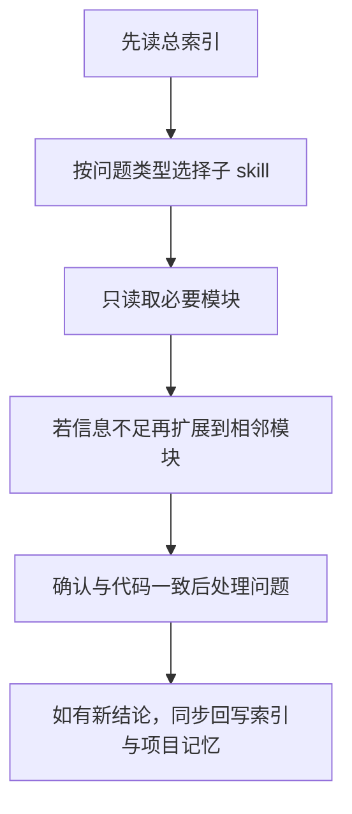

## POELike 接手 Skill

> 本文件已改为**总索引入口**。
> 
> 原先的大段接手说明已拆分到 `POELike_接手Skill/` 目录下的多个子 skill 文档里，后续请先读本索引，再按模块定向读取，避免一次性读取整份长文导致上下文过大。

### 这份索引现在负责什么

- **告诉你该先读哪一块**
- **把问题映射到对应子 skill 文档**
- **约束后续阅读顺序：先索引，后定向精读**
- **在文档与当前代码冲突时，提醒你以代码为准**

### 使用原则

- **先读本索引**，不要一上来整份扫所有模块
- **按问题类型只读必要模块**，控制上下文体积
- **若文档与当前代码冲突，以当前代码为准**
- **确认差异后，要同步修正文档**

### 模块总览

- [skill-01 全局入口与阅读顺序](POELike_接手Skill/Skill_01_全局入口与阅读顺序.md)
  - 适合：刚接手项目、还没建立全局地图时
  - 负责：主干链路、阅读顺序、状态拥有者思路

- [skill-02 ECS 与运行时主链](POELike_接手Skill/Skill_02_ECS与运行时主链.md)
  - 适合：进入场景、系统执行、输入写入、运行时职责类问题
  - 负责：`GameManager / World / GameSceneInitializer / GameSceneManager / Systems / 怪物地面掉落事件桥接`

- [skill-03 背包 / 装备 / 宝石交互](POELike_接手Skill/Skill_03_背包_装备_宝石交互.md)
  - 适合：拿起 / 放下 / 替换 / 镶嵌 / 连结 / 地面拾取入包与容量检测类问题
  - 负责：`BagItemView / BagBox / EquipmentSlotView / SocketItem / BagPanel / UIManager`

- [skill-04 UI / Tips 与角色面板](POELike_接手Skill/Skill_04_UI_Tips与角色面板.md)
  - 适合：Tips 位置、层级、内容、角色面板刷新、血蓝显示、地面掉落名称高亮类问题
  - 负责：`UIManager / EquipmentItem / EquipmentTips / CharactorMainPanelController / CharactorMassagePanelController / NpcMeshRenderer / GroundItemLabelRenderer`

- [skill-05 技能系统 / 技能栏与快捷键](POELike_接手Skill/Skill_05_技能系统_技能栏与快捷键.md)
  - 适合：技能释放、技能栏显示、8 槽键位、左键分流、冷却 Mask 类问题
  - 负责：`GameSceneManager / PlayerInputComponent / SkillComponent / SkillFactory / SkillSystem / CharactorMainPanelController`

- [skill-06 装备生成 / 商店 / NPC 与配置工具链](POELike_接手Skill/Skill_06_装备生成_商店_NPC与配置工具链.md)
  - 适合：配置不生效、商店到背包映射、NPC 对话 / 商店入口类问题
  - 负责：`EquipmentConfigLoader / EquipmentGenerator / EquipmentBagDataFactory / ShopPanel / Npc* / 工具链`

- [skill-07 SOP / 排错与高风险点](POELike_接手Skill/Skill_07_SOP_排错与高风险点.md)
  - 适合：准备动手修改、快速排障、担心踩坑时
  - 负责：修改 SOP、排错速查、高风险点

### 问题 -> 应先读哪个子 skill

#### 想快速理解项目全貌

先读：

1. [skill-01](POELike_接手Skill/Skill_01_全局入口与阅读顺序.md)
2. [skill-02](POELike_接手Skill/Skill_02_ECS与运行时主链.md)

#### 想改背包、装备、宝石交互

先读：

1. [skill-03](POELike_接手Skill/Skill_03_背包_装备_宝石交互.md)
2. 如涉及展示，再补 [skill-04](POELike_接手Skill/Skill_04_UI_Tips与角色面板.md)
3. 如涉及配置 / 商店，再补 [skill-06](POELike_接手Skill/Skill_06_装备生成_商店_NPC与配置工具链.md)

#### 想改技能释放、技能栏、快捷键、支持宝石

先读：

1. [skill-05](POELike_接手Skill/Skill_05_技能系统_技能栏与快捷键.md)
2. 如涉及运行时主链，再补 [skill-02](POELike_接手Skill/Skill_02_ECS与运行时主链.md)
3. 如涉及装备孔位 / 连结辅助宝石，再补 [skill-03](POELike_接手Skill/Skill_03_背包_装备_宝石交互.md)

#### 想改 Tips、UI 层级、角色面板显示、地面掉落名称高亮

先读：

1. [skill-04](POELike_接手Skill/Skill_04_UI_Tips与角色面板.md)
2. 如怀疑数据源不对，再补 [skill-03](POELike_接手Skill/Skill_03_背包_装备_宝石交互.md) 或 [skill-06](POELike_接手Skill/Skill_06_装备生成_商店_NPC与配置工具链.md)

#### 想改装备生成、商店、NPC、配置工具链

先读：

1. [skill-06](POELike_接手Skill/Skill_06_装备生成_商店_NPC与配置工具链.md)
2. 如需要具体操作步骤，再补 [skill-07](POELike_接手Skill/Skill_07_SOP_排错与高风险点.md)

### 当前必须记住的少量事实

- **项目主干不是某个 UI 面板，而是 `GameManager + World + Systems + GameSceneManager + UIManager`**
- **背包核心不是 `BagPanel`，而是 `BagItemView`**
- **技能释放链** 和 **技能栏显示链** 是两条链，不能混着改
- **正式运行时技能槽位当前是 8 槽**
- **默认技能键位当前是 `LMB / MMB / RMB / Q / W / E / R / T`**
- **左键当前有 `Skill1 / Move / Blocked` 判定分流**
- **怪物死亡地面掉落名当前走 `EntityDiedEvent -> GameSceneManager -> GroundItemDroppedEvent -> GroundItemLabelRenderer`**

- **地面掉落名称标签当前自带背景，鼠标移入时会按名称实际宽高整块高亮背景与文字**
- **点击地面掉落名称时，当前会先做背包空间检测；放不下时提示“背包放不下了”，放得下才真正入包并移除地面标签**
- **`StatModifier` 当前定义在 `StatTypes.cs` 中为 `struct`，处理 `Prefixes / Suffixes` 时不要写 `modifier == null` 这类判空**

- **装备孔位连结当前仍只支持相邻索引，但连结开关已由 `SocketData.LinkedToPrevious` 数据驱动**

- **后续每完成一次有效开发步骤，都要同步更新本索引与 [POELike_项目记忆.md](POELike_项目记忆.md)**

### 推荐读取工作流

### 一句话版本

以后处理这个项目时，**先读 [POELike_接手Skill.md](POELike_接手Skill.md) 这个总索引，再按问题跳到 `skill-01 ~ skill-07` 的子文档，不再整份硬读旧长文。**