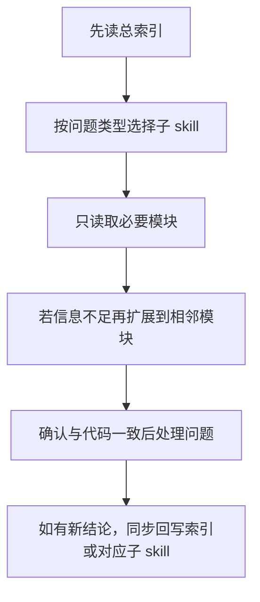

## POELike 接手 Skill

> 本文件已改为**总索引入口**。
> 
> 原先的大段接手说明已拆分到 `POELike_接手Skill/` 目录下的多个子 skill 文档里，后续请先读本索引，再按模块定向读取，避免一次性读取整份长文导致上下文过大。

### 这份索引现在负责什么

- **告诉你该先读哪一块**
- **把问题映射到对应子 skill 文档**
- **约束后续阅读顺序：先索引，后定向精读**
- **在文档与当前代码冲突时，提醒你以代码为准**

### 使用原则

- **先读本索引**，不要一上来整份扫所有模块
- **只把本索引当成唯一文档入口**，通过它跳到对应子 skill；不再读取 `POELike_项目记忆.md`
- **按问题类型只读必要模块**，控制上下文体积
- **若文档与当前代码冲突，以当前代码为准**
- **确认差异后，要同步修正文档**

### 模块总览

- [skill-01 全局入口与阅读顺序](POELike_接手Skill/Skill_01_全局入口与阅读顺序.md)
  - 适合：刚接手项目、还没建立全局地图时
  - 负责：主干链路、阅读顺序、状态拥有者思路

- [skill-02 ECS 与运行时主链](POELike_接手Skill/Skill_02_ECS与运行时主链.md)
  - 适合：进入场景、系统执行、输入写入、运行时职责类问题
  - 负责：`GameManager / World / GameSceneInitializer / GameSceneManager / Systems / 怪物地面掉落事件桥接`

- [skill-03 背包 / 装备 / 宝石交互](POELike_接手Skill/Skill_03_背包_装备_宝石交互.md)
  - 适合：拿起 / 放下 / 替换 / 镶嵌 / 连结 / 地面拾取入包 / 通货自动合堆与拆组 / 容量检测类问题
  - 负责：`BagItemView / BagItemData / BagBox / EquipmentSlotView / SocketItem / BagPanel / UIManager`

- [skill-04 UI / Tips 与角色面板](POELike_接手Skill/Skill_04_UI_Tips与角色面板.md)
  - 适合：Tips 位置、层级、内容、角色面板刷新、血蓝显示、通货数量角标、地面掉落名称高亮与数量显示类问题
  - 负责：`UIManager / EquipmentItem / EquipmentTips / CharactorMainPanelController / CharactorMassagePanelController / NpcMeshRenderer / GroundItemLabelRenderer`

- [skill-05 技能系统 / 技能栏与快捷键](POELike_接手Skill/Skill_05_技能系统_技能栏与快捷键.md)
  - 适合：技能释放、技能栏显示、8 槽键位、左键分流、冷却 Mask 类问题
  - 负责：`GameSceneManager / PlayerInputComponent / SkillComponent / SkillFactory / SkillSystem / CharactorMainPanelController`

- [skill-06 装备生成 / 商店 / NPC 与配置工具链](POELike_接手Skill/Skill_06_装备生成_商店_NPC与配置工具链.md)
  - 适合：配置不生效、商店到背包映射、NPC 对话 / 商店入口、通货配置 / GM 通货生成 / Excel 导表、地图布局 / 地图装饰 / 地图内容配置类问题
  - 负责：`EquipmentConfigLoader / EquipmentGenerator / EquipmentBagDataFactory / CurrencyConfigLoader / CurrencyBagDataFactory / GMItemFactory / ShopPanel / Npc* / MapLayoutConfigLoader / MapDecorationConfigLoader / MapContentConfigLoader / 工具链`

- [skill-07 SOP / 排错与高风险点](POELike_接手Skill/Skill_07_SOP_排错与高风险点.md)
  - 适合：准备动手修改、快速排障、担心踩坑时
  - 负责：修改 SOP、排错速查、高风险点

### 问题 -> 应先读哪个子 skill

#### 想快速理解项目全貌

先读：

1. [skill-01](POELike_接手Skill/Skill_01_全局入口与阅读顺序.md)
2. [skill-02](POELike_接手Skill/Skill_02_ECS与运行时主链.md)

#### 想改背包、装备、宝石交互

先读：

1. [skill-03](POELike_接手Skill/Skill_03_背包_装备_宝石交互.md)
2. 如涉及展示，再补 [skill-04](POELike_接手Skill/Skill_04_UI_Tips与角色面板.md)
3. 如涉及配置 / 商店，再补 [skill-06](POELike_接手Skill/Skill_06_装备生成_商店_NPC与配置工具链.md)

#### 想改技能释放、技能栏、快捷键、支持宝石

先读：

1. [skill-05](POELike_接手Skill/Skill_05_技能系统_技能栏与快捷键.md)
2. 如涉及运行时主链，再补 [skill-02](POELike_接手Skill/Skill_02_ECS与运行时主链.md)
3. 如涉及装备孔位 / 连结辅助宝石，再补 [skill-03](POELike_接手Skill/Skill_03_背包_装备_宝石交互.md)

#### 想改 Tips、UI 层级、角色面板显示、地面掉落名称高亮

先读：

1. [skill-04](POELike_接手Skill/Skill_04_UI_Tips与角色面板.md)
2. 如怀疑数据源不对，再补 [skill-03](POELike_接手Skill/Skill_03_背包_装备_宝石交互.md) 或 [skill-06](POELike_接手Skill/Skill_06_装备生成_商店_NPC与配置工具链.md)

#### 想改装备生成、商店、NPC、配置工具链

先读：

1. [skill-06](POELike_接手Skill/Skill_06_装备生成_商店_NPC与配置工具链.md)
2. 如需要具体操作步骤，再补 [skill-07](POELike_接手Skill/Skill_07_SOP_排错与高风险点.md)

### 当前必须记住的少量事实

- **项目主干不是某个 UI 面板，而是 `GameManager + World + Systems + GameSceneManager + UIManager`**
- **背包核心不是 `BagPanel`，而是 `BagItemView`**
- **技能释放链** 和 **技能栏显示链** 是两条链，不能混着改
- **正式运行时技能槽位当前是 8 槽**
- **默认技能键位当前是 `LMB / MMB / RMB / Q / W / E / R / T`**
- **左键当前有 `Skill1 / Move / Blocked` 判定分流**
- **`启动ExcelConvert.bat` 当前会优先使用内部 `ExcelExporter / excelConvert` 发布产物；若仓库里未提供这些内部工具，则自动走仓库内降级链：先刷新 `equipment.xlsx`，再把 `common/excel/xls/*.xlsx` 全量导出到 `Assets/Cfg/*.pb`**
- **当前进入 `GameScene` 和 `MissionScene` 都会先经过 `LoadingScene`**：`SceneLoader` 现在由持久化的 `GameManager` 协程全程驱动切换链，先切到 `LoadingScene`，再异步加载目标玩法场景；`LoadingSceneController` 只负责显示加载 UI，并把 `Slider.value` 跟随 `SceneLoader.CurrentLoadingProgress` 更新；在 `LoadingScene` 就绪后会先给出最小可见进度，再等待目标场景加载完成后激活，避免“进度条不动且卡在 LoadingScene”；另外项目当前运行在 Unity 6，编辑器 PlayMode 下的活动 Build Profile / Shared Scene List 可能与旧版 Build Settings 脱节，因此 `SceneLoader` 在 `UNITY_EDITOR` 下已改为优先按 `Assets/Scenes/*.unity` 路径加载，先绕过 Build Profile 漏配导致的 `MissionScene` 无法切入

- **NPC 按钮 `EventID=1004` 当前会打开 `DoorPanel`，并从 `MapLevelConf.pb` 读取地图关卡数据后动态生成地图按钮；点击地图按钮后不再停留在原 `GameScene` 内瞬移，而是会把当前角色与目标 `MapLevelData` 一起带入 `MissionScene`**：但这条链路当前会先经过 `LoadingScene`；`MissionScene` 启动时由 `GameSceneManager` 消费待传入地图，并按对应 `CfgID` 从 `MapLayoutConf.pb` 构建玩家出生点与 NPC 布局，从 `MapDecorationConf.pb` 构建地图装饰，从 `MapContentConf.pb` 构建怪物内容，同时基础地表/环境色也会随当前地图配置切换；按钮文字显示 `MapName`；当前 A1 / A2 测试数据要求每张地图至少保留一个带 `EventID=1004` 的 NPC（当前是 `NPCID=1001`），且 `CfgID=1001` 额外会刷柱子 + 祭坛布局、`CfgID=1002` 额外会刷箱体 + 标记物布局；由于玩家当前在 `MissionScene` 中仍走纯逻辑 ECS 位移，`GameSceneManager` 现已把无交互地图装饰的 collider 也纳入 XZ 平面阻挡，角色撞到箱体 / 柱子 / 祭坛 / 标记物时会被拦住，不再穿模；并且碰撞修正当前会持续把角色推出障碍体外，只取消当次继续往障碍里钻的目标，不会让后续新的点击寻路永久失效；另外当前 `GameScene` 已与任务地图构建链分流，只保留 `NPCDataConf.pb` 中的默认 3 个 NPC，不再按 `MapLayoutConf.pb / MapContentConf.pb` 刷地图 NPC 或怪物；并且 `NPCDataConf.pb` 现已新增 `SceneName` 字段，`GameScene` 默认 NPC 会按 `SceneName` 过滤并使用 `NPCPosition` 固定坐标生成，`MissionScene` 则继续按 `MapLayoutConf.pb` 的地图布局坐标生成 NPC；当前 `GameScene` 的主角出生点也已改为配置驱动：`MapLayoutConf.pb` 的 `MapPlayerSpawnConf` 现新增 `GameSceneSpawnX / GameSceneSpawnY / GameSceneSpawnZ` 字段，`GameSceneManager` 会优先读取该固定坐标，缺省回退到 `2,0,0`，而 `MissionScene` 仍继续使用地图锚点 + `OffsetX / OffsetZ` 偏移出生**

- **怪物配置里的 `MonsterRadius` 当前不能再直接映射为 AI 攻击距离**：`MonsterSpawner` 现在只会读取显式 `MonsterAttackRange`，若配置缺失则回退默认近战范围 `1.5`；否则怪物会在离玩家过远时就进入围攻停位 / 攻击圈，表现为围在角色周围固定抖动

- **怪物死亡地面掉落 / GM 入包当前可能走隐藏背包路径：`GroundItemLabelRenderer` 与 `GMPanel` 会通过 `UIManager.GetOrCreateBagPanel(false)` 在背包不可见时创建运行时物品视图；因此 `BagItemView` / `EquipmentItem` 当前都已改为惰性缓存组件引用，不能再假设 `Awake()` 一定先于 `Setup()` / `BindToBag()` 执行**
- **`EquipmentItem.EnsureStackCountText()` 运行时创建 `TextMeshProUGUI` 数量角标时，必须先解析并绑定 `TMP_FontAsset`（必要时同步写入 `fontSharedMaterial`），再去设置 `outlineWidth / outlineColor`**：否则在隐藏背包路径或运行时动态生成物品视图时，TMP 可能因为材质源为空而在 `CreateMaterialInstance(new Material(source))` 里抛 `ArgumentNullException: source`
- **`BagPanel.TryAddItemToBag()` 的堆叠分支里，不要在 `while` 子块和后续非堆叠分支重复声明同名局部变量 `view`**：当前 C# 编译器会把这种“外层块里又有子块同名局部变量”的写法判成 `CS0136`；堆叠分支建议改成更明确的名字，例如 `stackView`

- **通货系统当前已经接入运行时主链**：`CurrencyConfigLoader / CurrencyBagDataFactory / GMItemFactory.TryCreateCurrency / BagPanel.TryAddItemToBag` 已打通；通货支持 `StackCount / MaxStackCount`、自动合堆与超单堆拆组入包，`EquipmentItem` 会显示数量角标，`EquipmentTips` 会显示通货分类 / 效果 / 目标 / 堆叠信息

- **`CurrencyConfigLoader.EnsureLookupCaches()` 预热缓存时，不能写成 `var _ = Categories; _ = EffectTypes; _ = BaseCurrencies;`**：这里的 `_` 在当前 C# 环境里会被当成普通局部变量，而不是 discard；首行推断成 `IReadOnlyList<CurrencyCategoryData>` 后，第二行就会因赋入 `IReadOnlyList<CurrencyEffectTypeData>` 触发 `CS0266`。当前应改为分别访问属性（例如 `Categories.Count`）或使用不同局部变量名

- **怪物死亡地面掉落名当前走 `EntityDiedEvent -> GameSceneManager -> GroundItemDroppedEvent -> GroundItemLabelRenderer`；`GameSceneManager` 现已改为独立按概率尝试掉落装备与可堆叠通货，因此一次死亡可能只掉装备、只掉通货、两者都掉或都不掉；地面掉落转 `BagItemData` 时不能再按 `ItemType.Armour / Accessory` 展开整组大类槽位，当前已改为优先使用 `ItemData.PrimaryEquipmentSlot / AllowedEquipmentSlots` 的精确部位数据，旧数据再按名称关键词兜底推断；若掉落物是 `ItemType.Currency`，则会优先复用 `CurrencyBagDataFactory` 还原通货显示与堆叠数据，地面标签名称也会显示数量**

- **地面掉落名称标签当前自带背景，鼠标移入时会按名称实际宽高整块高亮背景与文字**
- **多个同点或近距离地面掉落标签当前仍会做有限的屏幕空间避让，尽量避免彼此遮挡；但标签位置现已改为缓存布局：只会在刚掉落时，或后续当前位置第一次被背包等 UI 面板遮挡时才重新排位。其余时间只保持原有避让槽位并跟随真实世界投影移动，不会再每帧自行换位置；被面板遮住时会按重叠区域裁剪遮挡，未被遮住的部分继续显示，超出屏幕时按真实投影直接裁切；并且当前布局避让只按真正可见的标签片段参与，被面板遮住或已经裁到屏幕外的不可见区域不会再把附近标签“吸附”挤走**

- **点击 NPC 名称或地面掉落名称时，当前会先锁定为交互意图，避免被同一左键的普通地面移动覆盖；角色进入交互距离后会立即停下并继续执行下一步（打开对话 / 执行拾取）**
- **点击地面掉落名称时，当前不会再直接秒捡，而是由 `GameSceneManager` 驱动角色先走近掉落；进入拾取范围后才会做背包空间检测，放不下时提示“背包放不下了”，放得下才真正入包并移除地面标签；这里的寻路目标始终使用原始掉落世界坐标，而不是避让重排后的 UI 位置**

- **`StatModifier` 当前定义在 `StatTypes.cs` 中为 `struct`，处理 `Prefixes / Suffixes` 时不要写 `modifier == null` 这类判空**

- **装备孔位连结当前仍只支持相邻索引，但连结开关已由 `SocketData.LinkedToPrevious` 数据驱动**

- **后续每完成一次有效开发步骤，只同步更新本索引或对应子 skill 文档，不再维护 `POELike_项目记忆.md`**

### 推荐读取工作流

### 一句话版本

以后处理这个项目时，**先读 [POELike_接手Skill.md](POELike_接手Skill.md) 这个总索引，再按问题跳到 `skill-01 ~ skill-07` 的子文档，不再整份硬读旧长文。**