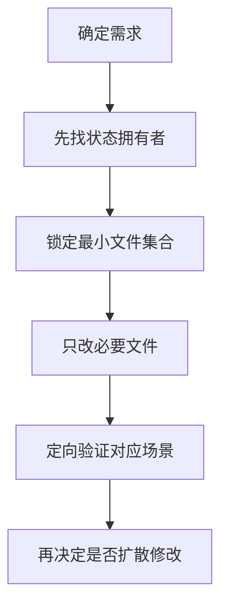

## POELike 接手 Skill

> 这不是项目介绍文，而是一份“后续接手时怎么动手”的操作手册。目标是：**尽量少猜，尽量快定位，尽量小范围修改。**

### 适用对象

- 后续继续开发该项目的人类开发者
- 需要在已有代码上继续迭代的 AI 编码助手
- 需要快速排查背包 / 装备 / 商店 / NPC / ECS 逻辑的人

### 先记住这几个事实

- **项目主干不是 UI，而是 `GameManager -> World -> Systems -> GameSceneManager`**
- **背包系统核心不是 `BagPanel`，而是 `BagItemView`**
- **装备 Tips 的“显示位置”和“显示内容”是分离的**
  - 位置：主要看 `EquipmentItem`
  - 内容：主要看 `EquipmentTips`
- **商店数据和背包数据不是一回事**
  - 商店常有完整 `GeneratedEquipment`
  - 背包常使用 `BagItemData`
- **装备 Tips 现在走独立最高层 Overlay，不应再直接依赖普通面板同级顺序**
  - 最高层入口：`UIManager.TooltipOverlayRoot`
  - 装备底栏：`CharactorMainPanelSortingOrder`
- **角色底栏里的技能图标，不是直接读取 `SkillComponent.SkillSlots`，而是优先显示装备/药剂带出来的“已插入主动技能宝石”**
- **后续每次发生有效代码或行为改动后，都要同步更新 `POELike_接手Skill.md` 与 `POELike_项目记忆.md`**
- **当前宝石连接线是 UI 推导结果，不是配置驱动结果**
  - `SocketData` 当前只有 `Color`
  - 没有“谁和谁相连”的数据字段
  - 但当前项目已明确约定：**只有相邻索引才算连结**，也就是 `index-1` / `index+1`

### 最快进入状态的阅读顺序

#### 读全局

1. [GameManager.cs](Assets/Scripts/Managers/GameManager.cs)
2. [UIManager.cs](Assets/Scripts/Managers/UIManager.cs)
3. [GameSceneInitializer.cs](Assets/Scripts/Game/GameSceneInitializer.cs)
4. [GameSceneManager.cs](Assets/Scripts/Game/GameSceneManager.cs)
5. [World.cs](Assets/Scripts/ECS/Core/World.cs)

#### 读玩法主干

1. [StatsSystem.cs](Assets/Scripts/ECS/Systems/StatsSystem.cs)
2. [MovementSystem.cs](Assets/Scripts/ECS/Systems/MovementSystem.cs)
3. [CombatSystem.cs](Assets/Scripts/ECS/Systems/CombatSystem.cs)
4. [SkillSystem.cs](Assets/Scripts/ECS/Systems/SkillSystem.cs)
5. [SkillComponent.cs](Assets/Scripts/ECS/Components/SkillComponent.cs)
6. [SkillFactory.cs](Assets/Scripts/Game/Skills/SkillFactory.cs)

#### 读背包 / 装备链路

1. [BagPanel.cs](Assets/Scripts/Game/UI/BagPanel.cs)
2. [BagBox.cs](Assets/Scripts/Game/UI/BagBox.cs)
3. [BagItemView.cs](Assets/Scripts/Game/UI/BagItemView.cs)
4. [EquipmentSlotView.cs](Assets/Scripts/Game/UI/EquipmentSlotView.cs)
5. [SocketItem.cs](Assets/Scripts/Game/UI/SocketItem.cs)
6. [EquipmentItem.cs](Assets/Scripts/Game/UI/EquipmentItem.cs)
7. [EquipmentTips.cs](Assets/Scripts/Game/UI/EquipmentTips.cs)
8. [BagItemData.cs](Assets/Scripts/Game/UI/BagItemData.cs)
9. [CharactorMainPanelController.cs](Assets/Scripts/Game/UI/CharactorMainPanelController.cs)
10. [CharactorMassagePanelController.cs](Assets/Scripts/Game/UI/CharactorMassagePanelController.cs)

#### 读装备生成 / 商店 / NPC

1. [EquipmentConfigLoader.cs](Assets/Scripts/Game/Equipment/EquipmentConfigLoader.cs)
2. [EquipmentGenerator.cs](Assets/Scripts/Game/Equipment/EquipmentGenerator.cs)
3. [ShopPanel.cs](Assets/Scripts/Game/UI/ShopPanel.cs)
4. [NpcButtonEventType.cs](Assets/Scripts/Game/NpcButtonEventType.cs)
5. [NpcConfigLoader.cs](Assets/Scripts/Game/NpcConfigLoader.cs)
6. [NpcDialogPanel.cs](Assets/Scripts/Game/UI/NpcDialogPanel.cs)

### 高频修改任务 -> 应该先看哪些文件

#### 1. 想改“进入游戏”流程

先看：

- [SceneLoader.cs](Assets/Scripts/Managers/SceneLoader.cs)
- [CharacterSelectPanel.cs](Assets/Scripts/Game/UI/CharacterSelectPanel.cs)
- [GameManager.cs](Assets/Scripts/Managers/GameManager.cs)
- [GameSceneManager.cs](Assets/Scripts/Game/GameSceneManager.cs)

#### 2. 想改角色属性、战斗数值、装备加成

先看：

- [EquipmentComponent.cs](Assets/Scripts/ECS/Components/EquipmentComponent.cs)
- [StatsSystem.cs](Assets/Scripts/ECS/Systems/StatsSystem.cs)
- [CombatSystem.cs](Assets/Scripts/ECS/Systems/CombatSystem.cs)
- [SkillSystem.cs](Assets/Scripts/ECS/Systems/SkillSystem.cs)

#### 3. 想改背包点击移动 / 放置规则

先看：

- [BagItemView.cs](Assets/Scripts/Game/UI/BagItemView.cs)
- [BagBox.cs](Assets/Scripts/Game/UI/BagBox.cs)
- [BagCell.cs](Assets/Scripts/Game/UI/BagCell.cs)
- [EquipmentSlotView.cs](Assets/Scripts/Game/UI/EquipmentSlotView.cs)
- [SocketItem.cs](Assets/Scripts/Game/UI/SocketItem.cs)

#### 4. 想改装备 Tips 的位置 / 翻边 / 跟随

先看：

- [EquipmentItem.cs](Assets/Scripts/Game/UI/EquipmentItem.cs)
- [EquipmentTips.cs](Assets/Scripts/Game/UI/EquipmentTips.cs)
- [UIManager.cs](Assets/Scripts/Managers/UIManager.cs)

#### 5. 想改装备 Tips 的内容

先看：

- [EquipmentTips.cs](Assets/Scripts/Game/UI/EquipmentTips.cs)
- [BagItemData.cs](Assets/Scripts/Game/UI/BagItemData.cs)
- [EquipmentGenerator.cs](Assets/Scripts/Game/Equipment/EquipmentGenerator.cs)
- [ShopPanel.cs](Assets/Scripts/Game/UI/ShopPanel.cs)

#### 6. 想改商店装备或购买后进背包的逻辑

先看：

- [ShopPanel.cs](Assets/Scripts/Game/UI/ShopPanel.cs)
- [EquipmentGenerator.cs](Assets/Scripts/Game/Equipment/EquipmentGenerator.cs)
- [BagItemData.cs](Assets/Scripts/Game/UI/BagItemData.cs)
- [BagPanel.cs](Assets/Scripts/Game/UI/BagPanel.cs)

#### 7. 想改 NPC 对话或按钮事件

先看：

- [NpcButtonEventType.cs](Assets/Scripts/Game/NpcButtonEventType.cs)
- [NpcConfigLoader.cs](Assets/Scripts/Game/NpcConfigLoader.cs)
- [NpcDialogPanel.cs](Assets/Scripts/Game/UI/NpcDialogPanel.cs)
- [GameSceneManager.cs](Assets/Scripts/Game/GameSceneManager.cs)

#### 8. 想改技能热键、施法链、测试技能或支持宝石

先看：

- [GameSceneManager.cs](Assets/Scripts/Game/GameSceneManager.cs)
- [SkillSystem.cs](Assets/Scripts/ECS/Systems/SkillSystem.cs)
- [SkillComponent.cs](Assets/Scripts/ECS/Components/SkillComponent.cs)
- [SkillFactory.cs](Assets/Scripts/Game/Skills/SkillFactory.cs)
- [GameSceneInitializer.cs](Assets/Scripts/Game/GameSceneInitializer.cs)
- [CharactorMainPanelController.cs](Assets/Scripts/Game/UI/CharactorMainPanelController.cs)

#### 9. 想改角色名称 / 等级 / 属性详情面板

先看：

- [CharactorMassagePanelController.cs](Assets/Scripts/Game/UI/CharactorMassagePanelController.cs)
- [UIManager.cs](Assets/Scripts/Managers/UIManager.cs)
- [GameSceneManager.cs](Assets/Scripts/Game/GameSceneManager.cs)
- [SceneLoader.cs](Assets/Scripts/Managers/SceneLoader.cs)
- [StatTypes.cs](Assets/Scripts/ECS/Components/StatTypes.cs)

### 当前已知行为约定

这些不是“可能如此”，而是近期已经被明确确认并修过的行为：

- 背包物品移动采用 **点击拿起 / 点击放下**，不是拖拽
- 背包点击搬运现在使用 **平滑跟手**
  - 拿起瞬间会 **立即贴到当前鼠标位置**
  - 后续跟随鼠标与背包预览格时，会走 `BagItemView` 的短时平滑阻尼
  - 若要调手感，优先看 `BagItemView.cs` 里的 `DragFollowSmoothTime`
- `CharactorMassagePanel` 当前不再随进入 `GameScene` 自动弹出
- `CharactorMassagePanel` 当前由 `UIManager` 使用 **`C` 键开关显示/关闭**
- `CharactorMassagePanel` 当前数据来源：
  - 名称 / 等级：`SceneLoader.PendingCharacterData`
  - 力量 / 智力 / 敏捷 与分类属性：玩家实体 `StatsComponent`
- `CharactorMassagePanel` 当前会在 **穿戴 / 卸下装备、插入 / 取下宝石** 后跟随 `UIManager.RefreshCharactorMainPanel()` 一起刷新
- `CharactorMassagePanel` 当前按钮行为：
  - `DamageBtn`：重建 `MassageArr`，显示伤害类描述和值
  - `DefenceBtn`：重建 `MassageArr`，显示防御类描述和值
  - `OtherBtn`：重建 `MassageArr`，显示除前两类之外的其他属性
- `CharactorMassagePanel` 当前在保留预置属性显示顺序的同时，会把 **新出现但不在预置数组里的词条** 先判断属于 **伤害 / 防御 / 其他** 哪一类，再追加到对应列表中
- `CharactorMassagePanel` 当前复用 `MassageArr + Massage.prefab + ListBox`，条目左侧 `Text` 为描述，右侧 `Value` 为数值
- 当前玩家基础三维属性已补默认值：`力量 / 敏捷 / 智力 = 10`
- Tips 会 **跟随装备当前的位置**
- Tips 越界时会 **翻到另一侧**
- 背包装备 Tips **不显示装备类型与占用尺寸**
- 背包装备 Tips **显示前缀 / 后缀词条**
- 装备 Tips 渲染层级遵循 **Tips 最高层，状态栏次之**；若再次出现被底栏遮挡，优先检查 `UIManager.TooltipOverlayRoot`
- 装备槽 / 药剂槽 / 宝石孔在目标已占用时，若除“已占位”之外的接纳条件都满足，会 **直接替换**，并让被替换物 **立即进入跟随鼠标状态**
- 背包内放到已占用区域时，只要目标区域只被 **同一个道具** 占用，也允许整件替换；点击被占用物时，落点优先按 **鼠标当前所在格子** 判断
- 药剂槽可以放在装备区下方的嵌套层级，`BagPanel` 会 **递归查找** 并注册 `Potion1 ~ Potion5`
- 药剂 Tips **不显示占用尺寸和可装备槽位**，只保留类型、充能、等级、恢复 / 持续 / 功能效果等信息
- 从装备栏卸下装备时，会 **恢复背包原始占格大小**
- 从装备槽替换下来的物品会保留原 `RuntimeItemData`，尤其要注意 **药剂充能状态**
- `BagPanel.EnsureInitialized()` 现在有 `_isInitializing` 防重入保护，角色底栏刷新时若背包仍在初始化，会 **直接跳过本次刷新**，避免再次打回背包初始化链
- 装备上的宝石槽现在采用 **动态布局 + 动态缩放 + 自动连接线**
- 装备放进装备栏后，不再只是装备本体变大；**宝石槽、连接线、宝石显示也会跟着一起放大**
- 当前连接线采用 **相邻索引连结规则**：只认 `index-1` / `index+1`
- 角色底栏主动技能槽现在采用 **稳定映射**
  - `CharactorMainPanelController` 用 `_skillSlotAssignments` 记住当前底栏槽位
  - 卸下某颗主动技能石时，只清空该槽位，其他未卸下技能不会自动左移
  - 新装上的主动技能会补到 **第一个空槽**
- 当前连结仍然不是 POE 那种真正的数据驱动拓扑，而是基于插槽索引规则推导

### 技能系统速记

#### 当前技能入口链

当前较新的主链路是：

1. [GameSceneManager.cs](Assets/Scripts/Game/GameSceneManager.cs) 在 `UpdateInput()` 中读取输入
2. 把技能输入写入 `PlayerInputComponent.SkillInputs`
3. 命中时通过 `World.EventBus.Publish(new SkillActivateEvent { ... })` 发给 [SkillSystem.cs](Assets/Scripts/ECS/Systems/SkillSystem.cs)
4. `SkillSystem` 负责：
   - 检查槽位是否有技能
   - 检查冷却
   - 检查是否正在施法
   - 检查魔力是否足够
   - 处理施法前摇 / 立即释放
   - 发布 `SkillCastStartEvent` / `SkillExecutedEvent`

#### 当前技能热键

以 [GameSceneManager.cs](Assets/Scripts/Game/GameSceneManager.cs) 为准：

- 普攻：项目级 `Attack` Action
- 技能 2~6：`E` / `R` / `T` / `F` / `G`
- 药剂 1~5：`1` / `2` / `3` / `4` / `5`

注意：

- 角色底栏 UI 默认会找 `Skill1 ~ Skill8` 这类显示槽
- 但当前真实技能输入不是“固定 8 个完整技能热键系统”
- **可见技能槽数量** 和 **当前真正有输入绑定的技能槽数量** 不是一个概念

#### `SkillComponent` 现在管什么

看 [SkillComponent.cs](Assets/Scripts/ECS/Components/SkillComponent.cs)：

- `SkillSlots`：技能槽列表
- `ActiveSkill`：当前正在施放的技能
- `IsCasting` / `CastTimer`：施法状态
- `InitializeSlots(6)`：当前玩家初始化为 6 个技能槽

#### `GameSceneInitializer` 里的测试技能分配

当前测试初始化会自动分配：

- 槽位 0：普通攻击
- 槽位 1：火球术 + 多重投射支持宝石 + 附加火焰伤害支持宝石
- 槽位 2：冰霜新星
- 槽位 3：闪现
- 槽位 4：旋风斩

#### 当前需要特别记住的技能现状

- `SkillFactory.CreateCyclone()` 返回的是 `SkillType.Channeling`
- 但当前 [SkillSystem.cs](Assets/Scripts/ECS/Systems/SkillSystem.cs) 的 `ExecuteSkill(...)` 只处理：
  - `Projectile`
  - `AoE`
  - `Attack`
  - `Movement`
- **`Channeling` 当前没有执行分支**

也就是说：

- “旋风斩已被分配到测试技能槽” 这件事是真的
- 但“旋风斩当前已完整实现” 这件事 **不能默认成立**
- 如果要修这个问题，首查 [SkillSystem.cs](Assets/Scripts/ECS/Systems/SkillSystem.cs)

### 角色底栏（技能 / 药剂显示）速记

#### 当前显示来源

看 [CharactorMainPanelController.cs](Assets/Scripts/Game/UI/CharactorMainPanelController.cs)：

- 药剂槽：从 `BagPanel.FillEquippedPotions(...)` 读取
- 技能槽：从 `BagPanel.GetSocketedActiveGems(...)` 读取
- `RefreshFromCurrentState()` 会先调用 `SyncSkillSlotAssignments()`
- `SyncSkillSlotAssignments()` 会先清掉已卸下的主动技能，再把新出现的主动技能补到空槽
- `ApplySkills()` 当前根据 `_skillSlotAssignments` 绘制底栏技能槽，而不是每次把 `_socketedActiveGems` 重新压缩重排

所以当前底栏更接近：

- **药剂区**：显示当前已装备药剂
- **技能区**：显示当前已插入并被识别为主动技能的宝石

补充记忆：

- 多个技能装配后，底栏槽位默认保持稳定；卸下其他技能石时，未卸下的主动技能石位置不变
- 当前稳定映射依赖 `BagPanel.GetSocketedActiveGems(...)` 持续返回同一份 `BagItemData` 引用；若未来改成重新构造数据对象，需要同步调整映射键

而不是“直接把 `SkillComponent.SkillSlots` 原样投影到 UI”

#### 为什么这件事重要

如果你改的是：

- 技能释放逻辑
- 技能热键
- 技能图标显示
- 宝石镶嵌后底栏变化

不要只看一边。
至少要分开看：

- **施法主链**：`GameSceneManager` / `SkillSystem` / `SkillComponent`
- **底栏展示主链**：`BagPanel` / `CharactorMainPanelController`

### 修改时的基本策略

#### 原则 1：先找“状态拥有者”

不要看到 UI 问题就只改 UI 表象。先判断状态真正归谁管：

- 位置 / 是否显示：通常归视图控制器管
- 数据内容：通常归数据模型或生成器管
- 放置是否合法：通常归容器 / 规则对象管

在本项目里经常对应为：

- `BagItemView`：状态拥有者
- `BagBox`：放置规则拥有者
- `EquipmentItem`：装备 UI 行为拥有者
- `EquipmentTips`：提示内容拥有者
- `UIManager`：游戏内 UI 层级拥有者（尤其是状态栏与 Tooltip Overlay 的排序）
- `SkillSystem`：技能释放与冷却拥有者
- `CharactorMainPanelController`：角色底栏展示拥有者

#### 原则 2：优先改最小闭环

例如你想改 Tips 内容，通常不要一上来同时改：

- `EquipmentItem`
- `EquipmentTips`
- `BagPanel`
- `ShopPanel`
- `EquipmentGenerator`

而应该先判断：

- 是“数据没有”
- 还是“数据有但没显示”
- 还是“只在某一条路径上没显示”

#### 原则 3：商店路径与背包路径要分开验证

如果你改了装备显示，最少要验证两类来源：

- 商店里的装备
- 背包里的装备

因为它们的数据来源可能不同。

#### 原则 4：技能“能放”与“能显示”是两条链

如果问题是“底栏有图标但技能放不出来”或“技能能放但底栏没变化”，不要混着改。

优先拆成两问：

- `SkillSystem` / 事件总线这一侧是否真的执行了技能？
- `BagPanel` / `CharactorMainPanelController` 这一侧是否真的拿到了主动技能宝石？

### 常见改动 SOP

#### SOP 1：新增一种装备基底或配置字段

1. 检查 [EquipmentConfigLoader.cs](Assets/Scripts/Game/Equipment/EquipmentConfigLoader.cs)
2. 检查 Excel 转换链路：
   - [Program.cs](Tools/GenEquipmentExcel/Program.cs)
   - [启动ExcelConvert.bat](启动ExcelConvert.bat)
3. 确认生成器是否消费新字段：
   - [EquipmentGenerator.cs](Assets/Scripts/Game/Equipment/EquipmentGenerator.cs)
4. 确认 UI 是否展示新字段：
   - [ShopPanel.cs](Assets/Scripts/Game/UI/ShopPanel.cs)
   - [EquipmentTips.cs](Assets/Scripts/Game/UI/EquipmentTips.cs)
   - [BagItemData.cs](Assets/Scripts/Game/UI/BagItemData.cs)

#### SOP 2：修改背包交互

1. 先看 [BagItemView.cs](Assets/Scripts/Game/UI/BagItemView.cs)
   - 当前是否已有 `CurrentDraggingItem`
   - 点击被占用目标时，是否把尝试放置交给 `CurrentBag / CurrentSlot / CurrentSocket`
   - `FindByData(...)` 是否还能正确拿到被替换物视图
2. 看放置规则 [BagBox.cs](Assets/Scripts/Game/UI/BagBox.cs)
   - 普通放置走 `CanPlaceItem(...)`
   - 占位替换走 `CanPlaceOrReplaceItem(...) / TryGetReplaceCandidate(...)`
3. 看目标容器：
   - 背包格子：[BagCell.cs](Assets/Scripts/Game/UI/BagCell.cs)
   - 装备槽：[EquipmentSlotView.cs](Assets/Scripts/Game/UI/EquipmentSlotView.cs)
   - 宝石孔：[SocketItem.cs](Assets/Scripts/Game/UI/SocketItem.cs)
4. 如果是“替换后旧物品没跟手”或“替换后状态丢了”
   - 优先检查 `TryBeginMove(...)`
   - 再查 `EquipmentSlotView` 中旧物品的 `RuntimeItemData` 回填
5. 最后再看视觉层 [EquipmentItem.cs](Assets/Scripts/Game/UI/EquipmentItem.cs)

#### SOP 3：修改 Tips 内容

1. 看 `EquipmentTips` 里有哪些 `Setup(...)` 路径
2. 查当前是从 `GeneratedEquipment` 还是 `BagItemData` 进入
3. 如果只改某一条路径，确认另一条不会空白或回退出错
4. 验证：
   - 商店装备
   - 背包装备
   - 装备栏装备

#### SOP 4：修改 Tips 位置

1. 看 [EquipmentItem.cs](Assets/Scripts/Game/UI/EquipmentItem.cs)
2. 确认 Tips 是否挂在根 Canvas 下
3. 确认位置是否按当前装备世界坐标实时重算
4. 验证左右翻边与上下边界
5. 若仍被底部状态栏覆盖，优先确认 Tips 是否挂到了 `UIManager.TooltipOverlayRoot`，而不是普通根 Canvas

#### SOP 5：修改 NPC 对话行为

1. 查按钮事件枚举 [NpcButtonEventType.cs](Assets/Scripts/Game/NpcButtonEventType.cs)
2. 查配置如何加载 [NpcConfigLoader.cs](Assets/Scripts/Game/NpcConfigLoader.cs)
3. 查面板如何响应 [NpcDialogPanel.cs](Assets/Scripts/Game/UI/NpcDialogPanel.cs)
4. 查运行时入口 [GameSceneManager.cs](Assets/Scripts/Game/GameSceneManager.cs)

#### SOP 6：修改技能释放或支持宝石

1. 查 [GameSceneManager.cs](Assets/Scripts/Game/GameSceneManager.cs) 的输入写入
2. 查 [SkillComponent.cs](Assets/Scripts/ECS/Components/SkillComponent.cs) 的槽位与施法状态
3. 查 [SkillSystem.cs](Assets/Scripts/ECS/Systems/SkillSystem.cs) 的事件处理与执行分支
4. 查 [SkillFactory.cs](Assets/Scripts/Game/Skills/SkillFactory.cs) 的测试技能与支持宝石构造
5. 若 UI 也要变化，再查 [CharactorMainPanelController.cs](Assets/Scripts/Game/UI/CharactorMainPanelController.cs)
6. 如果未来要让“装备孔位里的支持宝石”真正影响技能效果，优先复用：
   - [EquipmentItem.cs](Assets/Scripts/Game/UI/EquipmentItem.cs) 的 `AreSocketsLinked(...)` / `GetLinkedGems(...)`
   - [BagPanel.cs](Assets/Scripts/Game/UI/BagPanel.cs) 的 `GetLinkedGems(...)`
   - 当前规则固定为只认相邻索引 `index-1` / `index+1`

#### SOP 7：修改装备上的宝石槽显示

1. 先看 [EquipmentItem.cs](Assets/Scripts/Game/UI/EquipmentItem.cs)
2. 重点查：
   - `ShowSockets()`
   - `ResolveSocketLayoutMetrics()`
   - `ResolveSocketDisplayScale()`
   - `UpdateSocketLinkViews()`
   - `AreSocketsLinked(...)`
   - `TryGetLinkedSocketIndices(...)`
   - `GetLinkedGems(...)`
3. 再看 [SocketItem.cs](Assets/Scripts/Game/UI/SocketItem.cs) 的单孔视图与接纳逻辑
4. 如果要从项目级入口读取连结结果，再看 [BagPanel.cs](Assets/Scripts/Game/UI/BagPanel.cs) 的 `GetLinkedGems(...)`
5. 最后看 [EquipmentGenerator.cs](Assets/Scripts/Game/Equipment/EquipmentGenerator.cs) 的 `SocketData`
6. 如果你想做真正的 POE 连线关系，记住：**现在的数据层还没有连接拓扑字段**

### 最容易踩坑的点

#### 坑 1：把 `BagPanel` 当成背包主逻辑

`BagPanel` 更偏“面板控制器”，真正关键逻辑在：

- `BagItemView`
- `BagBox`
- `EquipmentSlotView`
- `SocketItem`

#### 坑 2：只改 `EquipmentTips`，却不改数据来源

如果词条不显示，很多时候不是 `EquipmentTips` 模板错了，而是：

- `BagItemData` 没有带上词条
- 或者 `ShopPanel` 转背包时没拷贝展示所需字段
- 或者 `GeneratedEquipment` 路径和 `BagItemData` 路径不一致

#### 坑 3：拿起 / 放下过程中的尺寸与父节点问题

涉及以下典型问题：

- 卸下装备后尺寸仍是装备栏大小
- Tips 跟着旧容器位置跑
- 跟随鼠标时锚点错
- 提示框虽然位置对，但仍被底栏盖住（通常是挂载父节点或 `sortingOrder` 错）

排查入口通常都是 [BagItemView.cs](Assets/Scripts/Game/UI/BagItemView.cs) 与 [EquipmentItem.cs](Assets/Scripts/Game/UI/EquipmentItem.cs)。

#### 坑 4：误把补丁标记写进源码

此项目历史中确实发生过这类问题，典型表现：

- `CS0106`
- 某个 `private` / `public` 看起来没问题却报错
- 实际原因是文件中混入了 `+`、`-`、`@@`

一旦遇到奇怪语法错误，优先检查源码里是否有补丁标记残留。

#### 坑 5：把“测试技能已分配”误当成“技能已完整实现”

当前典型案例就是：

- `旋风斩` 已经在 [GameSceneInitializer.cs](Assets/Scripts/Game/GameSceneInitializer.cs) 里分配给了技能槽
- 但 [SkillSystem.cs](Assets/Scripts/ECS/Systems/SkillSystem.cs) 并没有 `Channeling` 分支

所以看到技能图标、日志或初始化代码，不代表整条技能链已经做完。

#### 坑 6：把装备宝石连接线误当成数据层关系

当前 `SocketData` 只有颜色，没有连接关系。

这意味着：

- 你现在看到的连接线是 `EquipmentItem` 根据插槽索引规则推导出来的
- 当前规则固定为：**只连接相邻索引**，也就是 `index-1` / `index+1`
- 如果布局改了，连线会跟着新的索引布局一起变化
- 如果未来要支持“固定拓扑”“断链”“分组连接”，必须补数据结构，而不只是改 UI

### 排错速查表

#### 问题：物品点了拿不起来

优先看：

- [BagItemView.cs](Assets/Scripts/Game/UI/BagItemView.cs)
- 当前是否已有 `CurrentDraggingItem`
- 点击事件是否被上层 UI 吃掉

#### 问题：物品拿起来了但放不下

优先看：

- [BagBox.cs](Assets/Scripts/Game/UI/BagBox.cs)
- [EquipmentSlotView.cs](Assets/Scripts/Game/UI/EquipmentSlotView.cs)
- [SocketItem.cs](Assets/Scripts/Game/UI/SocketItem.cs)
- 当前物品 `Data` 是否缺失或类型不匹配

#### 问题：目标位置已有物品，但没有发生替换

优先看：

- [BagItemView.cs](Assets/Scripts/Game/UI/BagItemView.cs)
  - 点击被占用物时是否走到了目标容器的接纳逻辑
  - `TryDropToBag(...)` 是否使用了带 `PointerEventData` 的替换路径
- [BagBox.cs](Assets/Scripts/Game/UI/BagBox.cs)
  - `TryGetReplaceCandidate(...)` 是否正确识别“整个目标区域只被同一个道具占用”
- [EquipmentSlotView.cs](Assets/Scripts/Game/UI/EquipmentSlotView.cs)
- [SocketItem.cs](Assets/Scripts/Game/UI/SocketItem.cs)
- 被替换物若消失不见，再检查 `BagItemView.FindByData(...)` 和旧物品的 `TryBeginMove(...)`

#### 问题：Tips 出现在错误位置

优先看：

- [EquipmentItem.cs](Assets/Scripts/Game/UI/EquipmentItem.cs)
- 是否在根 Canvas 下定位
- 是否使用当前装备位置重算
- 是否实际挂在 `UIManager.TooltipOverlayRoot`

#### 问题：Tips 文案不对

优先看：

- [EquipmentTips.cs](Assets/Scripts/Game/UI/EquipmentTips.cs)
- [BagItemData.cs](Assets/Scripts/Game/UI/BagItemData.cs)
- [EquipmentGenerator.cs](Assets/Scripts/Game/Equipment/EquipmentGenerator.cs)

#### 问题：从装备栏卸下后尺寸不对

优先看：

- [BagItemView.cs](Assets/Scripts/Game/UI/BagItemView.cs)
- 背包格子尺寸缓存是否还在
- 进入移动状态时是否正确使用背包占格大小

#### 问题：商店显示正常，进背包后显示不正常

优先看：

- [ShopPanel.cs](Assets/Scripts/Game/UI/ShopPanel.cs)
- `GeneratedEquipment -> BagItemData` 的映射是否漏字段

#### 问题：技能按钮有显示，但按键没反应

优先看：

- [GameSceneManager.cs](Assets/Scripts/Game/GameSceneManager.cs) 是否真的发了 `SkillActivateEvent`
- [SkillSystem.cs](Assets/Scripts/ECS/Systems/SkillSystem.cs) 是否支持该 `SkillType`
- [SkillComponent.cs](Assets/Scripts/ECS/Components/SkillComponent.cs) 对应槽位是否真的有 `SkillData`
- 如果只是底栏图标正确，不代表施法链就一定正常

#### 问题：角色底栏刷新时引发连锁 UI 异常

优先看：

- [BagPanel.cs](Assets/Scripts/Game/UI/BagPanel.cs) 的 `_isInitializing`
- [CharactorMainPanelController.cs](Assets/Scripts/Game/UI/CharactorMainPanelController.cs) 的 `RefreshFromCurrentState()`
- [UIManager.cs](Assets/Scripts/Managers/UIManager.cs) 的 `CurrentBagPanel` / `RefreshCharactorMainPanel()`

#### 问题：宝石槽显示太挤 / 没跟着装备放大 / 连线不对

优先看：

- [EquipmentItem.cs](Assets/Scripts/Game/UI/EquipmentItem.cs)
- 当前是否走到了 `ShowSockets()`
- 当前 `SocketData` 是否仍然只有颜色，没有拓扑

### 推荐工作流

### 给未来 AI 助手的建议

如果你是后续接手的 AI，请优先这样理解项目：

- “游戏世界”问题先找 `GameManager / World / Systems / GameSceneManager`
- “背包交互”问题先找 `BagItemView`
- “装备展示”问题先分离成：
  - 位置问题 -> `EquipmentItem`
  - 内容问题 -> `EquipmentTips`
  - 数据问题 -> `BagItemData / EquipmentGenerator / ShopPanel`
- “技能能不能放”问题先找 `GameSceneManager / SkillSystem / SkillComponent`
- “技能图标为什么这样显示”问题再看 `BagPanel / CharactorMainPanelController`
- “配置不生效”问题先查工具链与 Loader，不要只盯 UI

### 最后一句话

接手这个项目时，**不要从“某个面板长什么样”开始理解，而要从“谁拥有状态、谁负责规则、谁只是展示”开始理解**。一旦掌握这一点，这个项目的结构会清晰很多。
