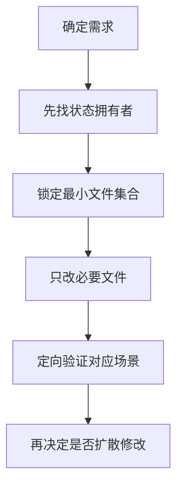

## POELike 接手 Skill

> 这不是项目介绍文，而是一份“后续接手时怎么动手”的操作手册。目标是：**尽量少猜，尽量快定位，尽量小范围修改。**

### 适用对象

这份 Skill 适合：

- 后续继续开发该项目的人类开发者
- 需要在已有代码上继续迭代的 AI 编码助手
- 需要快速排查背包 / 装备 / 商店 / NPC / ECS 逻辑的人

### 先记住这几个事实

- **项目主干不是 UI，而是 `GameManager -> World -> Systems -> GameSceneManager`**
- **背包系统核心不是 `BagPanel`，而是 `BagItemView`**
- **装备 Tips 的“显示位置”和“显示内容”是分离的**
  - 位置：主要看 `EquipmentItem`
  - 内容：主要看 `EquipmentTips`
- **商店数据和背包数据不是一回事**
  - 商店常有完整 `GeneratedEquipment`
  - 背包常使用 `BagItemData`

### 最快进入状态的阅读顺序

#### 读全局

1. [GameManager.cs](Assets/Scripts/Managers/GameManager.cs)
2. [UIManager.cs](Assets/Scripts/Managers/UIManager.cs)
3. [GameSceneInitializer.cs](Assets/Scripts/Game/GameSceneInitializer.cs)
4. [GameSceneManager.cs](Assets/Scripts/Game/GameSceneManager.cs)
5. [World.cs](Assets/Scripts/ECS/Core/World.cs)

#### 读玩法主干

1. [StatsSystem.cs](Assets/Scripts/ECS/Systems/StatsSystem.cs)
2. [MovementSystem.cs](Assets/Scripts/ECS/Systems/MovementSystem.cs)
3. [CombatSystem.cs](Assets/Scripts/ECS/Systems/CombatSystem.cs)
4. [SkillSystem.cs](Assets/Scripts/ECS/Systems/SkillSystem.cs)

#### 读背包 / 装备链路

1. [BagPanel.cs](Assets/Scripts/Game/UI/BagPanel.cs)
2. [BagBox.cs](Assets/Scripts/Game/UI/BagBox.cs)
3. [BagItemView.cs](Assets/Scripts/Game/UI/BagItemView.cs)
4. [EquipmentSlotView.cs](Assets/Scripts/Game/UI/EquipmentSlotView.cs)
5. [SocketItem.cs](Assets/Scripts/Game/UI/SocketItem.cs)
6. [EquipmentItem.cs](Assets/Scripts/Game/UI/EquipmentItem.cs)
7. [EquipmentTips.cs](Assets/Scripts/Game/UI/EquipmentTips.cs)
8. [BagItemData.cs](Assets/Scripts/Game/UI/BagItemData.cs)

#### 读装备生成 / 商店 / NPC

1. [EquipmentConfigLoader.cs](Assets/Scripts/Game/Equipment/EquipmentConfigLoader.cs)
2. [EquipmentGenerator.cs](Assets/Scripts/Game/Equipment/EquipmentGenerator.cs)
3. [ShopPanel.cs](Assets/Scripts/Game/UI/ShopPanel.cs)
4. [NpcButtonEventType.cs](Assets/Scripts/Game/NpcButtonEventType.cs)
5. [NpcConfigLoader.cs](Assets/Scripts/Game/NpcConfigLoader.cs)
6. [NpcDialogPanel.cs](Assets/Scripts/Game/UI/NpcDialogPanel.cs)

### 高频修改任务 -> 应该先看哪些文件

#### 1. 想改“进入游戏”流程

先看：

- [SceneLoader.cs](Assets/Scripts/Managers/SceneLoader.cs)
- [CharacterSelectPanel.cs](Assets/Scripts/Game/UI/CharacterSelectPanel.cs)
- [GameManager.cs](Assets/Scripts/Managers/GameManager.cs)
- [GameSceneManager.cs](Assets/Scripts/Game/GameSceneManager.cs)

#### 2. 想改角色属性、战斗数值、装备加成

先看：

- [EquipmentComponent.cs](Assets/Scripts/ECS/Components/EquipmentComponent.cs)
- [StatsSystem.cs](Assets/Scripts/ECS/Systems/StatsSystem.cs)
- [CombatSystem.cs](Assets/Scripts/ECS/Systems/CombatSystem.cs)
- [SkillSystem.cs](Assets/Scripts/ECS/Systems/SkillSystem.cs)

#### 3. 想改背包点击移动 / 放置规则

先看：

- [BagItemView.cs](Assets/Scripts/Game/UI/BagItemView.cs)
- [BagBox.cs](Assets/Scripts/Game/UI/BagBox.cs)
- [BagCell.cs](Assets/Scripts/Game/UI/BagCell.cs)
- [EquipmentSlotView.cs](Assets/Scripts/Game/UI/EquipmentSlotView.cs)
- [SocketItem.cs](Assets/Scripts/Game/UI/SocketItem.cs)

#### 4. 想改装备 Tips 的位置 / 翻边 / 跟随

先看：

- [EquipmentItem.cs](Assets/Scripts/Game/UI/EquipmentItem.cs)
- [EquipmentTips.cs](Assets/Scripts/Game/UI/EquipmentTips.cs)

#### 5. 想改装备 Tips 的内容

先看：

- [EquipmentTips.cs](Assets/Scripts/Game/UI/EquipmentTips.cs)
- [BagItemData.cs](Assets/Scripts/Game/UI/BagItemData.cs)
- [EquipmentGenerator.cs](Assets/Scripts/Game/Equipment/EquipmentGenerator.cs)
- [ShopPanel.cs](Assets/Scripts/Game/UI/ShopPanel.cs)

#### 6. 想改商店装备或购买后进背包的逻辑

先看：

- [ShopPanel.cs](Assets/Scripts/Game/UI/ShopPanel.cs)
- [EquipmentGenerator.cs](Assets/Scripts/Game/Equipment/EquipmentGenerator.cs)
- [BagItemData.cs](Assets/Scripts/Game/UI/BagItemData.cs)
- [BagPanel.cs](Assets/Scripts/Game/UI/BagPanel.cs)

#### 7. 想改 NPC 对话或按钮事件

先看：

- [NpcButtonEventType.cs](Assets/Scripts/Game/NpcButtonEventType.cs)
- [NpcConfigLoader.cs](Assets/Scripts/Game/NpcConfigLoader.cs)
- [NpcDialogPanel.cs](Assets/Scripts/Game/UI/NpcDialogPanel.cs)
- [GameSceneManager.cs](Assets/Scripts/Game/GameSceneManager.cs)

### 当前已知行为约定

这些不是“可能如此”，而是近期已经被明确确认并修过的行为：

- 背包物品移动采用 **点击拿起 / 点击放下**，不是拖拽
- Tips 会 **跟随装备当前的位置**
- Tips 越界时会 **翻到另一侧**
- 背包装备 Tips **不显示装备类型与占用尺寸**
- 背包装备 Tips **显示前缀 / 后缀词条**
- 装备槽 / 药剂槽 / 宝石孔在目标已占用时，若除“已占位”之外的接纳条件都满足，会 **直接替换**，并让被替换物 **立即进入跟随鼠标状态**
- 背包内放到已占用区域时，只要目标区域只被 **同一个道具** 占用，也允许整件替换；点击被占用物时，落点优先按 **鼠标当前所在格子** 判断
- 药剂槽可以放在装备区下方的嵌套层级，`BagPanel` 会 **递归查找** 并注册 `Potion1 ~ Potion5`
- 药剂 Tips **不显示占用尺寸和可装备槽位**，只保留类型、充能、等级、恢复 / 持续 / 功能效果等信息
- 从装备栏卸下装备时，会 **恢复背包原始占格大小**
- 从装备槽替换下来的物品会保留原 `RuntimeItemData`，尤其要注意 **药剂充能状态**

### 修改时的基本策略

#### 原则 1：先找“状态拥有者”

不要看到 UI 问题就只改 UI 表象。先判断状态真正归谁管：

- 位置 / 是否显示：通常归视图控制器管
- 数据内容：通常归数据模型或生成器管
- 放置是否合法：通常归容器 / 规则对象管

在本项目里经常对应为：

- `BagItemView`：状态拥有者
- `BagBox`：放置规则拥有者
- `EquipmentItem`：装备 UI 行为拥有者
- `EquipmentTips`：提示内容拥有者

#### 原则 2：优先改最小闭环

例如你想改 Tips 内容，通常不要一上来同时改：

- `EquipmentItem`
- `EquipmentTips`
- `BagPanel`
- `ShopPanel`
- `EquipmentGenerator`

而应该先判断：

- 是“数据没有”
- 还是“数据有但没显示”
- 还是“只在某一条路径上没显示”

#### 原则 3：商店路径与背包路径要分开验证

如果你改了装备显示，最少要验证两类来源：

- 商店里的装备
- 背包里的装备

因为它们的数据来源可能不同。

### 常见改动 SOP

#### SOP 1：新增一种装备基底或配置字段

1. 检查 [EquipmentConfigLoader.cs](Assets/Scripts/Game/Equipment/EquipmentConfigLoader.cs)
2. 检查 Excel 转换链路：
   - [Program.cs](Tools/GenEquipmentExcel/Program.cs)
   - [启动ExcelConvert.bat](启动ExcelConvert.bat)
3. 确认生成器是否消费新字段：
   - [EquipmentGenerator.cs](Assets/Scripts/Game/Equipment/EquipmentGenerator.cs)
4. 确认 UI 是否展示新字段：
   - [ShopPanel.cs](Assets/Scripts/Game/UI/ShopPanel.cs)
   - [EquipmentTips.cs](Assets/Scripts/Game/UI/EquipmentTips.cs)
   - [BagItemData.cs](Assets/Scripts/Game/UI/BagItemData.cs)

#### SOP 2：修改背包交互

1. 先看 [BagItemView.cs](Assets/Scripts/Game/UI/BagItemView.cs)
   - 当前是否已有 `CurrentDraggingItem`
   - 点击被占用目标时，是否把尝试放置交给 `CurrentBag / CurrentSlot / CurrentSocket`
   - `FindByData(...)` 是否还能正确拿到被替换物视图
2. 看放置规则 [BagBox.cs](Assets/Scripts/Game/UI/BagBox.cs)
   - 普通放置走 `CanPlaceItem(...)`
   - 占位替换走 `CanPlaceOrReplaceItem(...) / TryGetReplaceCandidate(...)`
3. 看目标容器：
   - 背包格子：[BagCell.cs](Assets/Scripts/Game/UI/BagCell.cs)
   - 装备槽：[EquipmentSlotView.cs](Assets/Scripts/Game/UI/EquipmentSlotView.cs)
   - 宝石孔：[SocketItem.cs](Assets/Scripts/Game/UI/SocketItem.cs)
4. 如果是“替换后旧物品没跟手”或“替换后状态丢了”
   - 优先检查 `TryBeginMove(...)`
   - 再查 `EquipmentSlotView` 中旧物品的 `RuntimeItemData` 回填
5. 最后再看视觉层 [EquipmentItem.cs](Assets/Scripts/Game/UI/EquipmentItem.cs)

#### SOP 3：修改 Tips 内容

1. 看 `EquipmentTips` 里有哪些 `Setup(...)` 路径
2. 查当前是从 `GeneratedEquipment` 还是 `BagItemData` 进入
3. 如果只改某一条路径，确认另一条不会空白或回退出错
4. 验证：
   - 商店装备
   - 背包装备
   - 装备栏装备

#### SOP 4：修改 Tips 位置

1. 看 [EquipmentItem.cs](Assets/Scripts/Game/UI/EquipmentItem.cs)
2. 确认 Tips 是否挂在根 Canvas 下
3. 确认位置是否按当前装备世界坐标实时重算
4. 验证左右翻边与上下边界

#### SOP 5：修改 NPC 对话行为

1. 查按钮事件枚举 [NpcButtonEventType.cs](Assets/Scripts/Game/NpcButtonEventType.cs)
2. 查配置如何加载 [NpcConfigLoader.cs](Assets/Scripts/Game/NpcConfigLoader.cs)
3. 查面板如何响应 [NpcDialogPanel.cs](Assets/Scripts/Game/UI/NpcDialogPanel.cs)
4. 查运行时入口 [GameSceneManager.cs](Assets/Scripts/Game/GameSceneManager.cs)

### 最容易踩坑的点

#### 坑 1：把 `BagPanel` 当成背包主逻辑

`BagPanel` 更偏“面板控制器”，真正关键逻辑在：

- `BagItemView`
- `BagBox`
- `EquipmentSlotView`
- `SocketItem`

#### 坑 2：只改 `EquipmentTips`，却不改数据来源

如果词条不显示，很多时候不是 `EquipmentTips` 模板错了，而是：

- `BagItemData` 没有带上词条
- 或者 `ShopPanel` 转背包时没拷贝展示所需字段
- 或者 `GeneratedEquipment` 路径和 `BagItemData` 路径不一致

#### 坑 3：拿起 / 放下过程中的尺寸与父节点问题

涉及以下典型问题：

- 卸下装备后尺寸仍是装备栏大小
- Tips 跟着旧容器位置跑
- 跟随鼠标时锚点错

排查入口通常都是 [BagItemView.cs](Assets/Scripts/Game/UI/BagItemView.cs) 与 [EquipmentItem.cs](Assets/Scripts/Game/UI/EquipmentItem.cs)。

#### 坑 4：误把补丁标记写进源码

此项目历史中确实发生过这类问题，典型表现：

- `CS0106`
- 某个 `private` / `public` 看起来没问题却报错
- 实际原因是文件中混入了 `+`、`-`、`@@`

一旦遇到奇怪语法错误，优先检查源码里是否有补丁标记残留。

### 排错速查表

#### 问题：物品点了拿不起来

优先看：

- [BagItemView.cs](Assets/Scripts/Game/UI/BagItemView.cs)
- 当前是否已有 `CurrentDraggingItem`
- 点击事件是否被上层 UI 吃掉

#### 问题：物品拿起来了但放不下

优先看：

- [BagBox.cs](Assets/Scripts/Game/UI/BagBox.cs)
- [EquipmentSlotView.cs](Assets/Scripts/Game/UI/EquipmentSlotView.cs)
- [SocketItem.cs](Assets/Scripts/Game/UI/SocketItem.cs)
- 当前物品 `Data` 是否缺失或类型不匹配

#### 问题：目标位置已有物品，但没有发生替换

优先看：

- [BagItemView.cs](Assets/Scripts/Game/UI/BagItemView.cs)
  - 点击被占用物时是否走到了目标容器的接纳逻辑
  - `TryDropToBag(...)` 是否使用了带 `PointerEventData` 的替换路径
- [BagBox.cs](Assets/Scripts/Game/UI/BagBox.cs)
  - `TryGetReplaceCandidate(...)` 是否正确识别“整个目标区域只被同一个道具占用”
- [EquipmentSlotView.cs](Assets/Scripts/Game/UI/EquipmentSlotView.cs)
- [SocketItem.cs](Assets/Scripts/Game/UI/SocketItem.cs)
- 被替换物若消失不见，再检查 `BagItemView.FindByData(...)` 和旧物品的 `TryBeginMove(...)`

#### 问题：Tips 出现在错误位置

优先看：

- [EquipmentItem.cs](Assets/Scripts/Game/UI/EquipmentItem.cs)
- 是否在根 Canvas 下定位
- 是否使用当前装备位置重算

#### 问题：Tips 文案不对

优先看：

- [EquipmentTips.cs](Assets/Scripts/Game/UI/EquipmentTips.cs)
- [BagItemData.cs](Assets/Scripts/Game/UI/BagItemData.cs)
- [EquipmentGenerator.cs](Assets/Scripts/Game/Equipment/EquipmentGenerator.cs)

#### 问题：从装备栏卸下后尺寸不对

优先看：

- [BagItemView.cs](Assets/Scripts/Game/UI/BagItemView.cs)
- 背包格子尺寸缓存是否还在
- 进入移动状态时是否正确使用背包占格大小

#### 问题：商店显示正常，进背包后显示不正常

优先看：

- [ShopPanel.cs](Assets/Scripts/Game/UI/ShopPanel.cs)
- `GeneratedEquipment -> BagItemData` 的映射是否漏字段

### 推荐工作流

### 给未来 AI 助手的建议

如果你是后续接手的 AI，请优先这样理解项目：

- “游戏世界”问题先找 `GameManager / World / Systems / GameSceneManager`
- “背包交互”问题先找 `BagItemView`
- “装备展示”问题先分离成：
  - 位置问题 -> `EquipmentItem`
  - 内容问题 -> `EquipmentTips`
  - 数据问题 -> `BagItemData / EquipmentGenerator / ShopPanel`
- “配置不生效”问题先查工具链与 Loader，不要只盯 UI

### 最后一句话

接手这个项目时，**不要从“某个面板长什么样”开始理解，而要从“谁拥有状态、谁负责规则、谁只是展示”开始理解**。一旦掌握这一点，这个项目的结构会清晰很多。
