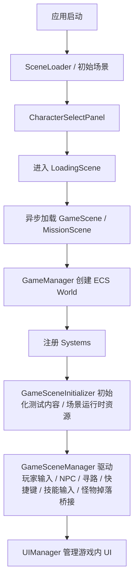

## skill-02 ECS 与运行时主链

> 目标：**搞清楚运行时是谁在创建世界、谁在驱动系统、谁在处理输入与场景逻辑。**
> 
> 如果问题属于“进入场景后为什么会这样运行”，优先读本模块。

### 主链概览

### 核心文件与职责

#### [GameManager.cs](../Assets/Scripts/Managers/GameManager.cs)

- **ECS 世界总入口之一**
- 负责创建 `World`
- 负责注册 / 初始化系统
- 负责保证关键运行时管理器存在

#### [SceneLoader.cs](../Assets/Scripts/Managers/SceneLoader.cs) / [LoadingSceneController.cs](../Assets/Scripts/Managers/LoadingSceneController.cs)

- **玩法场景切换总入口**
- 当前从角色选择进入 `GameScene`、以及从 `DoorPanel` 进入 `MissionScene` 都会先进入 `LoadingScene`
- 真实加载流程当前由持久化 `GameManager` 上启动的 `SceneLoader` 协程全程驱动，`LoadingSceneController` 只负责显示加载 UI
- 当前进入 `LoadingScene` 时，`GameManager` 会先确保场景内存在 `LoadingSceneController`；控制器会优先接管场景里现有 `LoadingPanel` 下的 `Slider`，若场景 UI 缺失才兜底创建运行时加载 UI
- `LoadingSceneController` 会驱动 `Slider.value` 跟随 `SceneLoader.CurrentLoadingProgress` 更新，待进度完成后再激活目标场景

#### [World.cs](../Assets/Scripts/ECS/Core/World.cs)

- **ECS 运行时容器**
- 管理实体、组件索引、查询与系统执行
- 若遇到“某组件明明挂了但系统没扫到”，优先回到这里确认查询链路

#### [GameSceneInitializer.cs](../Assets/Scripts/Game/GameSceneInitializer.cs)

- **进入场景后的初始化器**
- 当前负责：
  - 预热技能特效池
  - 自动分配测试装备
  - 自动分配测试技能
  - 打印玩家属性调试信息
- 若问题是“为什么开局就自带这些内容”，先看这里

#### [GameSceneManager.cs](../Assets/Scripts/Game/GameSceneManager.cs)

- **运行时总控入口之一**
- 当前主要负责：
  - 玩家 / 怪物 / NPC / UI 主链串联
  - 鼠标地面寻路
  - NPC 名称点击 / 对话入口
  - 技能输入采集与写入 `PlayerInputComponent`
  - 药剂快捷键处理
  - 左键 `Skill1 / Move / Blocked` 判定分流
  - `DoorPanel` 地图选择后的 `MissionScene` 切换（实际会先经过 `LoadingScene`），以及新场景内的地图出生点 / 地图装饰 / NPC 布局 / 地图内容构建

  - 监听 `EntityDiedEvent` 并桥接怪物地面掉落到 `GroundItemDroppedEvent`（当前会独立尝试掉落装备与可堆叠通货）

- 如果现象与“玩家输入后发生了什么”有关，优先查这里

### 系统层阅读顺序

#### 1. [StatsSystem.cs](../Assets/Scripts/ECS/Systems/StatsSystem.cs)

- 属性聚合 / 重算入口
- 改装备词条、角色面板数值、伤害基础值时优先看这里

#### 2. [MovementSystem.cs](../Assets/Scripts/ECS/Systems/MovementSystem.cs)

- 负责实体移动
- 与 `GameSceneManager` 的输入写入、`MovementComponent` 的状态共同决定玩家移动
- 施法锁移动也会影响这里

#### 3. [CombatSystem.cs](../Assets/Scripts/ECS/Systems/CombatSystem.cs)

- 负责伤害、死亡、战斗事件
- 若技能“执行了但没伤害”或怪物死亡清理异常，常需要同时看这里

#### 4. [SkillSystem.cs](../Assets/Scripts/ECS/Systems/SkillSystem.cs)

- 负责技能触发、冷却、施法前摇、引导、技能运行时实体创建
- 输入链到了这里，才算真正进入技能执行域

### 关键组件阅读顺序

#### [PlayerInputComponent.cs](../Assets/Scripts/ECS/Components/PlayerInputComponent.cs)

- 玩家输入缓冲区
- 当前包含：
  - `SkillInputs`
  - `SkillHeldInputs`
  - `SkillReleasedInputs`
- 这些输入由 `GameSceneManager` / `PlayerController` 写入，再由系统消费

#### [SkillComponent.cs](../Assets/Scripts/ECS/Components/SkillComponent.cs)

- 技能槽与施法状态拥有者
- 当前关键字段包括：
  - `SkillSlots`
  - `ActiveSkill`
  - `IsCasting`
  - `CastTimer`
  - `IsChanneling`
  - `ChannelTickTimer`
  - `ActiveChannelRuntime`
- 注意：`InitializeSlots(int count = 6)` 默认参数仍是 `6`，**但当前正式玩家初始化由 `GameSceneManager` 与 `PlayerController` 显式调用 `InitializeSlots(8)`**

#### [MovementComponent.cs](../Assets/Scripts/ECS/Components/MovementComponent.cs)

- 移动目标、方向、施法锁移动状态
- `IsMovementLockedByCasting` 是施法期间停止寻路 / 停止积压输入的重要标记

### 当前运行时能力约定

#### 玩家技能槽容量

- 当前正式运行时按 **8 槽** 工作
- 显式入口：
  - [GameSceneManager.cs](../Assets/Scripts/Game/GameSceneManager.cs)
  - [PlayerController.cs](../Assets/Scripts/Game/Character/PlayerController.cs)
- 不要只看 `SkillComponent.InitializeSlots()` 的默认参数就误判系统仍然是 6 槽

#### 当前默认测试技能

看 [GameSceneInitializer.cs](../Assets/Scripts/Game/GameSceneInitializer.cs)：

- 槽位 0：重击
- 槽位 1：火球术 + 多重投射 + 附加火焰伤害
- 槽位 2：冰霜新星
- 槽位 3：闪现
- 槽位 4：旋风斩

如果有人反馈“开局为什么就有这些技能”，根因通常不在 UI，而在初始化流程

#### 左键判定分流

看 [GameSceneManager.cs](../Assets/Scripts/Game/GameSceneManager.cs)：

- 当前一次左键按下会锁定为：
  - `Skill1`
  - `Move`
  - `Blocked`
- 点击 NPC 名称或地面掉落名称时，当前也会立即把本次左键锁定为交互路径，避免同一帧继续落入普通点地移动
- 进入 NPC / 地面掉落交互距离后，当前由 `GameSceneManager` 立即停下并继续执行下一步（打开对话 / 执行拾取），不再依赖寻路完全结束后的额外时机
- 整次按住过程中不会中途切换
- 若要改 POE 风格左键行为，优先查：
  - `ResolveLeftMouseIntent()`
  - `TryBeginLeftClickSkill()`
  - `FindMonsterUnderCursor()`
  - `ResolveLeftClickSkillRange()`

### 常见排查入口

#### 问题：进入场景后状态就不对

优先看：

- [GameSceneInitializer.cs](../Assets/Scripts/Game/GameSceneInitializer.cs)
- [GameManager.cs](../Assets/Scripts/Managers/GameManager.cs)
- [World.cs](../Assets/Scripts/ECS/Core/World.cs)

#### 问题：按键输入了，但没有后续动作

优先看：

- [GameSceneManager.cs](../Assets/Scripts/Game/GameSceneManager.cs)
- [PlayerInputComponent.cs](../Assets/Scripts/ECS/Components/PlayerInputComponent.cs)
- [SkillSystem.cs](../Assets/Scripts/ECS/Systems/SkillSystem.cs)
- [MovementSystem.cs](../Assets/Scripts/ECS/Systems/MovementSystem.cs)

#### 问题：施法时移动 / 寻路行为异常

优先看：

- [SkillSystem.cs](../Assets/Scripts/ECS/Systems/SkillSystem.cs)
- [MovementComponent.cs](../Assets/Scripts/ECS/Components/MovementComponent.cs)
- [MovementSystem.cs](../Assets/Scripts/ECS/Systems/MovementSystem.cs)
- [GameSceneManager.cs](../Assets/Scripts/Game/GameSceneManager.cs)

#### 问题：怪物围在玩家周围固定位置抖动

优先看：

- [MonsterSpawner.cs](../Assets/Scripts/Game/MonsterSpawner.cs)
- [AISystem.cs](../Assets/Scripts/ECS/Systems/AISystem.cs)
- [MovementSystem.cs](../Assets/Scripts/ECS/Systems/MovementSystem.cs)

关键事实：

- **`MonsterRadius` 不能再直接映射成怪物 `AttackRange`**
- 若把配置里的半径字段误当攻击距离，怪物会离玩家过远就进入围攻停位 / 攻击圈，表现为围在角色附近固定站位并持续抖动
- **怪物攻击态当前不是“站住后按冷却无限打”**：`AISystem` 现在会在进入 `Attack` 时开启一整轮攻击周期，先走 `AttackDuration`，再走 `AttackInterval`；这两个时间没走完之前怪物不会恢复追踪。整轮结束后，才会按玩家当前位置重新进入 `Chase` 或下一轮 `Attack`
- **`UpdateAttackState()` 在攻击轮次结束时不能无条件切回 `Chase`**：如果玩家仍在近身容差内，应该直接重开下一轮 `Attack`；编队层和攻击名额判断都不应抢先把它打回 `Chase`，否则会和追击逻辑互相抢状态，表现成怪物贴身来回震动
- **`CanEnterAttackState()` 在怪物已经贴身时不能再被攻击名额 / 编队环拦住**：若怪物中心距离已经进入 `AttackRange + AttackPushExtraDist`，应直接允许进入 `Attack`；否则会出现“明明已进攻击范围却仍沿着编队槽位跟随玩家抖动”
- **`ApplyPlayerChaserFormation()` 不应直接把 `Attack` 态切回 `Chase`**：攻击态退出统一由 `UpdateAttackState()` 按真实距离决定；编队层只负责朝向与站位，否则会和状态机重复改状态，形成贴身震动
- **`MovementSystem / MonsterSimulateCompute` 在 `AIState.Attack` 下不能继续做玩家-怪物分离**：攻击态若还被 GPU / CPU 分离持续从玩家身边推开，就会表现成“已经进攻击态却还跟随玩家并震动”；当前攻击锁位应同时表示“停止主动移动 + 跳过玩家分离”
- **地图装饰阻挡当前不再只作用于玩家**：`GameSceneManager` 现会把 `_currentMapBlockingColliders` 同步成怪物可读的障碍快照，`MovementSystem` 会在 CPU 回退和 GPU `MonsterSimulateCompute` 两条链里都执行怪物-障碍物推离；因此任务地图里的柱子 / 箱体 / 祭坛 / 标记物现在也会阻挡生成后的怪物，不再只拦玩家
- **`Chase -> Attack` 的进入阈值必须至少覆盖 `Chase` 的停止圈，`Attack` 结束后也要有独立保持壳层**：如果进入攻击仍用更小的 `AttackRange`，但追击停止却用更大的 `AttackRange + ChaseStopExtraDist`，怪物就会在“已贴身停住但又进不了 Attack”的区间里停在 `Chase` 和 `Attack` 之间来回抢状态；当前 `AISystem` 已统一让进入攻击覆盖停止圈，并在攻击轮次结束后只有真正脱离 `AttackRange + FormationAttackBreakExtraDist` 才恢复追击

### 从本模块跳到哪里

- **要看技能释放、技能栏、快捷键、冷却显示**：转 [skill-05](./Skill_05_技能系统_技能栏与快捷键.md)
- **要看背包 / 装备 / 宝石链路**：转 [skill-03](./Skill_03_背包_装备_宝石交互.md)
- **要看 UI / Tips / 面板展示**：转 [skill-04](./Skill_04_UI_Tips与角色面板.md)
- **要看 SOP / 常见坑**：转 [skill-07](./Skill_07_SOP_排错与高风险点.md)
