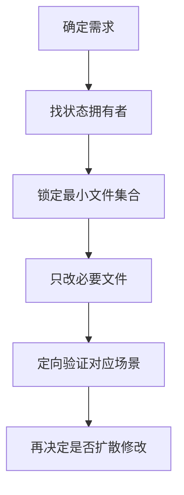

## skill-07 SOP / 排错与高风险点

> 目标：**把“怎么动手”“怎么排错”“哪些地方最容易踩坑”收成单独一份。**
> 
> 当你已经知道问题大概在哪条链，但想快速开工或快速排障，优先读本模块。

### 修改时的基本策略

#### 原则 1：先找状态拥有者

不要看到 UI 问题就只改 UI 表象。先判断状态真正归谁管：

- **位置 / 是否显示**：通常归视图控制器管
- **数据内容**：通常归数据模型或生成器管
- **放置是否合法**：通常归容器 / 规则对象管
- **技能能否触发**：通常归输入链和 `SkillSystem` 管

#### 原则 2：优先改最小闭环

先判断问题属于：

- **数据没有**
- **数据有但没显示**
- **某一条路径没覆盖**
- **状态更新了但旧 UI 没刷新**

不要一上来跨很多文件同时大改。

#### 原则 3：一条链至少验证两端

例如：

- 改装备展示，要分别看 **商店** 和 **背包 / 装备栏**
- 改技能，要分别看 **能否释放** 和 **底栏是否同步**
- 改 Tips，要分别看 **定位** 和 **内容**

### 常见改动 SOP

#### SOP 1：新增一种装备基底或配置字段

1. 看 [EquipmentConfigLoader.cs](../Assets/Scripts/Game/Equipment/EquipmentConfigLoader.cs)
2. 看 [Program.cs](../Tools/GenEquipmentExcel/Program.cs)
3. 看 [启动ExcelConvert.bat](../启动ExcelConvert.bat)（当前会优先使用内部 ExcelConvert；缺失时会先刷新 `equipment.xlsx`，再把 `common/excel/xls/*.xlsx` 全量导出到 `Assets/Cfg/*.pb`）
4. 看 [EquipmentGenerator.cs](../Assets/Scripts/Game/Equipment/EquipmentGenerator.cs)
5. 看 [ShopPanel.cs](../Assets/Scripts/Game/UI/ShopPanel.cs)
6. 看 [BagItemData.cs](../Assets/Scripts/Game/UI/BagItemData.cs)
7. 最后再看展示层 UI

#### SOP 2：修改背包交互

1. 先看 [BagItemView.cs](../Assets/Scripts/Game/UI/BagItemView.cs)
2. 再看 [BagBox.cs](../Assets/Scripts/Game/UI/BagBox.cs)
3. 再看目标容器：
   - [BagCell.cs](../Assets/Scripts/Game/UI/BagCell.cs)
   - [EquipmentSlotView.cs](../Assets/Scripts/Game/UI/EquipmentSlotView.cs)
   - [SocketItem.cs](../Assets/Scripts/Game/UI/SocketItem.cs)
4. 最后才看视觉层 [EquipmentItem.cs](../Assets/Scripts/Game/UI/EquipmentItem.cs)

#### SOP 3：修改 Tips 内容

1. 看 [EquipmentTips.cs](../Assets/Scripts/Game/UI/EquipmentTips.cs)
2. 查当前是从 `GeneratedEquipment` 还是 `BagItemData` 进入
3. 验证：
   - 商店装备
   - 背包装备
   - 装备栏装备

#### SOP 4：修改 Tips 位置 / 层级

1. 看 [EquipmentItem.cs](../Assets/Scripts/Game/UI/EquipmentItem.cs)
2. 确认 Tips 是否挂在 `UIManager.TooltipOverlayRoot`
3. 确认位置是否按当前装备位置实时重算
4. 验证左右翻边与上下边界

#### SOP 5：修改 NPC 对话或按钮行为

1. 看 [NpcButtonEventType.cs](../Assets/Scripts/Game/NpcButtonEventType.cs)
2. 看 [NpcConfigLoader.cs](../Assets/Scripts/Game/NpcConfigLoader.cs)
3. 如涉及传送门地图列表、点击后传送、玩家出生布局、NPC 布局、地图装饰布局或地图内容刷新，再看 [MapLevelConfigLoader.cs](../Assets/Scripts/Game/MapLevelConfigLoader.cs) / [MapLayoutConfigLoader.cs](../Assets/Scripts/Game/MapLayoutConfigLoader.cs) / [MapDecorationConfigLoader.cs](../Assets/Scripts/Game/MapDecorationConfigLoader.cs) / [MapContentConfigLoader.cs](../Assets/Scripts/Game/MapContentConfigLoader.cs) / [DoorPanel.cs](../Assets/Scripts/Game/UI/DoorPanel.cs)
   - A1 之后还要额外检查：当前地图在 `MapLayoutConf.pb` 中是否至少保留了一个可打开 `DoorPanel` 的 NPC；当前测试数据里的入口 NPC 是 `NPCID=1001`
   - A2 之后还要额外检查：当前地图在 `MapDecorationConf.pb` 中是否真的配置了装饰数据；若 `DecorationType` 不是 `Pillar / Crate / Marker / Shrine` 之一，运行时会跳过并输出警告

4. 看 [NpcDialogPanel.cs](../Assets/Scripts/Game/UI/NpcDialogPanel.cs)
5. 看 [GameSceneManager.cs](../Assets/Scripts/Game/GameSceneManager.cs)

#### SOP 6：修改技能释放或支持宝石

1. 看 [GameSceneManager.cs](../Assets/Scripts/Game/GameSceneManager.cs)
2. 看 [SkillComponent.cs](../Assets/Scripts/ECS/Components/SkillComponent.cs)
3. 看 [SkillSystem.cs](../Assets/Scripts/ECS/Systems/SkillSystem.cs)
4. 看 [SkillFactory.cs](../Assets/Scripts/Game/Skills/SkillFactory.cs)
5. 如涉及底栏，再看 [CharactorMainPanelController.cs](../Assets/Scripts/Game/UI/CharactorMainPanelController.cs)
6. 如涉及宝石连结，再看 [EquipmentItem.cs](../Assets/Scripts/Game/UI/EquipmentItem.cs) / [BagPanel.cs](../Assets/Scripts/Game/UI/BagPanel.cs)

### 排错速查表

#### 问题：物品点了拿不起来

优先看：

- [BagItemView.cs](../Assets/Scripts/Game/UI/BagItemView.cs)
- 是否已有 `CurrentDraggingItem`
- 点击是否被上层 UI 吃掉

#### 问题：物品拿起来了但放不下

优先看：

- [BagBox.cs](../Assets/Scripts/Game/UI/BagBox.cs)
- [EquipmentSlotView.cs](../Assets/Scripts/Game/UI/EquipmentSlotView.cs)
- [SocketItem.cs](../Assets/Scripts/Game/UI/SocketItem.cs)

#### 问题：目标位置已有物品，但没有发生替换

优先看：

- [BagItemView.cs](../Assets/Scripts/Game/UI/BagItemView.cs)
- [BagBox.cs](../Assets/Scripts/Game/UI/BagBox.cs)
- [EquipmentSlotView.cs](../Assets/Scripts/Game/UI/EquipmentSlotView.cs)
- [SocketItem.cs](../Assets/Scripts/Game/UI/SocketItem.cs)

#### 问题：Tips 出现在错误位置 / 被挡住

优先看：

- [EquipmentItem.cs](../Assets/Scripts/Game/UI/EquipmentItem.cs)
- [UIManager.cs](../Assets/Scripts/Managers/UIManager.cs)
- `TooltipOverlayRoot`

#### 问题：Tips 文案不对

优先看：

- [EquipmentTips.cs](../Assets/Scripts/Game/UI/EquipmentTips.cs)
- [BagItemData.cs](../Assets/Scripts/Game/UI/BagItemData.cs)
- [EquipmentGenerator.cs](../Assets/Scripts/Game/Equipment/EquipmentGenerator.cs)

#### 问题：技能按钮有显示，但按键没反应

优先看：

- [GameSceneManager.cs](../Assets/Scripts/Game/GameSceneManager.cs)
- [SkillSystem.cs](../Assets/Scripts/ECS/Systems/SkillSystem.cs)
- [SkillComponent.cs](../Assets/Scripts/ECS/Components/SkillComponent.cs)

#### 问题：左键行为和预期不一致

优先看：

- [GameSceneManager.cs](../Assets/Scripts/Game/GameSceneManager.cs)
- `ResolveLeftMouseIntent()`
- `TryBeginLeftClickSkill()`
- `FindMonsterUnderCursor()`
- `ResolveLeftClickSkillRange()`

#### 问题：角色底栏刷新引发连锁 UI 异常

优先看：

- [BagPanel.cs](../Assets/Scripts/Game/UI/BagPanel.cs) 的 `_isInitializing`
- [CharactorMainPanelController.cs](../Assets/Scripts/Game/UI/CharactorMainPanelController.cs)
- [UIManager.cs](../Assets/Scripts/Managers/UIManager.cs)

#### 问题：技能冷却 Mask 或血蓝遮罩不更新

优先看：

- [CharactorMainPanelController.cs](../Assets/Scripts/Game/UI/CharactorMainPanelController.cs)
- 当前目标 `Image` 是否正确绑定
- 上游状态是否真的在变化

### 高风险点

#### 坑 1：把 `BagPanel` 当成背包主逻辑

它更像控制器 / 聚合入口，真正的移动和规则核心通常在：

- `BagItemView`
- `BagBox`
- `EquipmentSlotView`
- `SocketItem`

#### 坑 2：只改 `EquipmentTips`，不改数据来源

很多时候不是模板错，而是：

- `BagItemData` 没带字段
- `GeneratedEquipment -> BagItemData` 映射漏字段
- 商店路径和背包路径没有一起改

#### 坑 3：把“技能已显示”误当成“技能链已完整实现”

底栏显示的是一条链，技能释放是另一条链；两边都得验证。

#### 坑 4：只看 `SkillComponent.InitializeSlots()` 的默认参数就误判当前槽位数

当前正式运行时已经显式初始化为 **8 槽**。

#### 坑 5：忽视旧文档中的历史残留描述

一些旧段落可能和当前代码已不一致。**遇到冲突，以代码为准，并把修正同步到文档。**

#### 坑 6：误把补丁标记写进源码

若遇到奇怪语法错误，优先检查是否混入了：

- `+`
- `-`
- `@@`

#### 坑 7：运行时动态创建 `TextMeshProUGUI` 时，先设描边再绑字体

尤其是 [EquipmentItem.cs](../Assets/Scripts/Game/UI/EquipmentItem.cs) 这类会在隐藏背包路径里运行时创建数量角标的地方：

- 要先解析并绑定 `TMP_FontAsset`
- 若字体材质可用，最好同步写入 `fontSharedMaterial`
- 最后再设置 `outlineWidth / outlineColor`

否则 TMP 可能在内部 `CreateMaterialInstance(new Material(source))` 时因为 `source` 为空而抛 `ArgumentNullException`

#### 坑 8：忘记同步接手 Skill 索引 / 子模块文档

每次有效开发步骤完成后，要同步更新：

- [POELike_接手Skill.md](../POELike_接手Skill.md)
- 当前实际修改对应的 `skill-01 ~ skill-07` 子模块文档

### 推荐工作流

### 从本模块跳到哪里

- **要看总索引**：转 [POELike_接手Skill.md](../POELike_接手Skill.md)
- **要看全局入口**：转 [skill-01](./Skill_01_全局入口与阅读顺序.md)
- **要看运行时主链**：转 [skill-02](./Skill_02_ECS与运行时主链.md)
- **要看背包 / 装备 / 宝石**：转 [skill-03](./Skill_03_背包_装备_宝石交互.md)
- **要看 UI / Tips / 角色面板**：转 [skill-04](./Skill_04_UI_Tips与角色面板.md)
- **要看技能系统 / 技能栏 / 快捷键**：转 [skill-05](./Skill_05_技能系统_技能栏与快捷键.md)
- **要看装备生成 / 商店 / NPC / 配置**：转 [skill-06](./Skill_06_装备生成_商店_NPC与配置工具链.md)
