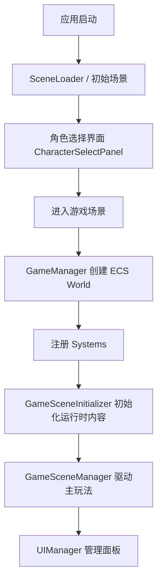
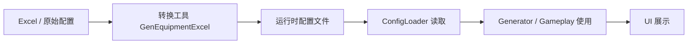

## POELike 项目记忆

> 本文档用于给未来的开发者 / AI 助手快速恢复项目上下文。内容基于当前仓库结构、关键脚本命名以及最近一段时间已经确认并落地的行为修改。

### 项目定位

`POELike` 是一个 **Unity + C#** 的类 POE ARPG 原型项目。

当前代码结构已经形成几个比较清晰的层次：

- **管理层**：负责游戏启动、场景切换、UI 管理
- **ECS 层**：负责实体、组件、系统以及战斗/属性/技能等核心逻辑
- **Game 层**：负责场景初始化、装备生成、NPC、背包、商店等具体玩法
- **UI 层**：负责背包、装备栏、Tips、对话框、商店等可视交互
- **工具链**：负责 Excel / 配置转运行时数据
- **UI 层级约定**：装备 Tips 使用独立最高层 `TooltipOverlay`，层级高于角色底部状态栏

### 环境与依赖

- Unity 版本以 [ProjectVersion.txt](ProjectSettings/ProjectVersion.txt) 为准
- 包依赖以 [manifest.json](Packages/manifest.json) 为准
- 当前代码可确认使用到：
  - Unity UI
  - TextMeshPro
  - 新输入系统（如 `UnityEngine.InputSystem`）

### 启动总链路

### 目录与关键文件索引

#### 管理器

- [GameManager.cs](Assets/Scripts/Managers/GameManager.cs)
  - 游戏主入口之一
  - 负责 ECS World 初始化与系统注册
  - 负责在启动时调整 Input System 更新模式，并确保 `UIManager` 常驻
- [UIManager.cs](Assets/Scripts/Managers/UIManager.cs)
  - 负责 UI 面板加载、打开、关闭、缓存/池化
  - 负责创建常驻 `UIRootCanvas`、`UIEventSystem`、`TooltipOverlay`
  - 负责 `I` 键背包开关、`C` 键角色属性页开关与角色底栏排序控制
- [SceneLoader.cs](Assets/Scripts/Managers/SceneLoader.cs)
  - 负责场景切换入口

#### 场景与游戏流程

- [GameSceneManager.cs](Assets/Scripts/Game/GameSceneManager.cs)
  - 运行时主控制器之一
  - 串起玩家、怪物、NPC、UI 交互
  - 当前也是主要的**技能输入写入者**与**药剂热键处理入口**
- [GameSceneInitializer.cs](Assets/Scripts/Game/GameSceneInitializer.cs)
  - 负责进入游戏场景后的初始化
  - 当前会自动分配一套测试装备与测试技能
  - 通常适合查找运行时对象生成、环境布置、初始实体准备

#### ECS

- [World.cs](Assets/Scripts/ECS/Core/World.cs)
  - ECS 世界核心
  - 负责实体存储、查询、系统执行基础设施
- [StatsSystem.cs](Assets/Scripts/ECS/Systems/StatsSystem.cs)
  - 属性重算入口
- [MovementSystem.cs](Assets/Scripts/ECS/Systems/MovementSystem.cs)
  - 移动系统
  - 当前是**玩家 CPU 移动 + 怪物 GPU ComputeShader 并行模拟**的混合架构
- [CombatSystem.cs](Assets/Scripts/ECS/Systems/CombatSystem.cs)
  - 战斗结算
- [SkillSystem.cs](Assets/Scripts/ECS/Systems/SkillSystem.cs)
  - 技能释放 / 冷却 / 技能事件流
- [EquipmentComponent.cs](Assets/Scripts/ECS/Components/EquipmentComponent.cs)
  - 装备数据与角色属性挂接的重要组件
- [SkillComponent.cs](Assets/Scripts/ECS/Components/SkillComponent.cs)
  - 技能槽、施法状态、运行时技能数据
- [MonsterComponent.cs](Assets/Scripts/ECS/Components/MonsterComponent.cs)
  - 怪物运行时数据入口之一

#### 装备 / 配置 / 商店 / NPC

- [EquipmentGenerator.cs](Assets/Scripts/Game/Equipment/EquipmentGenerator.cs)
  - 运行时装备生成核心
  - `GeneratedEquipment`、词缀、插槽、商店货品通常都从这里延伸
- [EquipmentConfigLoader.cs](Assets/Scripts/Game/Equipment/EquipmentConfigLoader.cs)
  - 装备配置加载器
- [ShopPanel.cs](Assets/Scripts/Game/UI/ShopPanel.cs)
  - 商店 UI
- [NpcConfigLoader.cs](Assets/Scripts/Game/NpcConfigLoader.cs)
  - NPC / 对话 / 按钮配置加载
- [NpcButtonEventType.cs](Assets/Scripts/Game/NpcButtonEventType.cs)
  - NPC 对话按钮事件枚举
- [NpcDialogPanel.cs](Assets/Scripts/Game/UI/NpcDialogPanel.cs)
  - NPC 对话面板

#### 背包 / 装备 UI

- [BagPanel.cs](Assets/Scripts/Game/UI/BagPanel.cs)
  - 背包主面板控制器
  - 当前带 `_isInitializing` 防重入保护
- [BagBox.cs](Assets/Scripts/Game/UI/BagBox.cs)
  - 背包格子容器、占用与放置规则
- [BagCell.cs](Assets/Scripts/Game/UI/BagCell.cs)
  - 单个格子点击 / 悬停响应
- [BagItemView.cs](Assets/Scripts/Game/UI/BagItemView.cs)
  - 道具在背包 / 装备栏 / 插槽之间移动的核心状态机
- [BagItemData.cs](Assets/Scripts/Game/UI/BagItemData.cs)
  - UI 侧道具数据模型
- [EquipmentItem.cs](Assets/Scripts/Game/UI/EquipmentItem.cs)
  - 装备图标可视层、插槽显示、Tips 入口
  - 当前负责宝石槽动态布局、动态缩放、自动连接线
- [EquipmentSlotView.cs](Assets/Scripts/Game/UI/EquipmentSlotView.cs)
  - 装备栏槽位
- [SocketItem.cs](Assets/Scripts/Game/UI/SocketItem.cs)
  - 宝石孔槽位
- [EquipmentTips.cs](Assets/Scripts/Game/UI/EquipmentTips.cs)
  - 装备提示框
- [CharactorMainPanelController.cs](Assets/Scripts/Game/UI/CharactorMainPanelController.cs)
  - 角色底栏显示控制器
  - 当前从 `BagPanel` 刷药剂与主动技能宝石显示
- [CharactorMassagePanelController.cs](Assets/Scripts/Game/UI/CharactorMassagePanelController.cs)
  - 角色信息 / 属性详情面板控制器
  - 当前负责角色名称、等级、力量、智力、敏捷，以及伤害 / 防御 / 其他属性分类列表刷新
  - 当前会在保留预置属性顺序的基础上，把新增属性按三类自动归类追加到面板列表

#### 角色选择 / 存档 / 调试

- [CharacterSelectPanel.cs](Assets/Scripts/Game/UI/CharacterSelectPanel.cs)
  - 角色选择与进游戏入口
- [GMPanel.cs](Assets/Scripts/Game/UI/GMPanel.cs)
  - 调试 / GM 功能面板，具体能力以源码为准

#### 工具链

- [Program.cs](Tools/GenEquipmentExcel/Program.cs)
  - Excel 转装备配置工具入口
- [启动ExcelConvert.bat](启动ExcelConvert.bat)
  - 工具链批处理入口

### ECS 架构记忆

#### 核心理解

项目的 ECS 主体可以按下列思路理解：

- `World` 是运行时容器
- Entity 负责标识实体
- Component 负责承载数据
- System 负责扫描实体并执行业务逻辑

#### 已知关键系统职责

- **`StatsSystem`**
  - 负责基础属性、装备属性、修饰器的综合重算
  - 改属性问题时优先看这里
- **`MovementSystem`**
  - 负责实体移动
  - 当前不是纯 CPU 简单遍历，而是：
    - 玩家移动：CPU 处理
    - 怪物移动：ComputeShader + AsyncGPUReadback + CPU 回退
- **`CombatSystem`**
  - 负责伤害、死亡、战斗事件
- **`SkillSystem`**
  - 负责技能触发、技能状态、冷却与技能事件流

#### ECS 与玩法层的关系

- 装备、NPC、玩家、怪物等可见对象，通常最终都要落回 ECS 世界或由 ECS 状态驱动
- 场景初始化负责把“场景对象 / 数据配置”接到 ECS
- UI 更多是 ECS / Game 数据的展示和操作入口，而不是最终权威数据源

### 游戏场景与运行时职责

`GameSceneManager` 与 `GameSceneInitializer` 是接手运行时逻辑时最值得先读的两个文件：

- `GameSceneInitializer`
  - 更偏初始化与布置
  - 适合查“进入场景时做了什么”
  - 当前会自动给玩家挂测试装备，并分配测试技能
- `GameSceneManager`
  - 更偏运行时总控
  - 适合查“玩家/怪物/NPC/UI 怎么串起来”
  - 当前还负责：
    - 鼠标地面寻路
    - NPC 标签点击寻路与到达后对话
    - 技能输入写入
    - 药剂快捷键使用

可把它们理解为：

- **Initializer**：把世界搭起来
- **SceneManager**：让世界运行起来

### UI 架构记忆

#### `UIManager` 的定位

`UIManager` 负责：

- 面板加载
- 面板打开 / 关闭
- 可能的实例复用 / 池化
- 场景切换时 UI 生命周期协调
- 游戏内 UI 排序层控制（包括角色底栏与 Tooltip Overlay）
- 常驻 `UIRootCanvas` / `UIEventSystem` / `TooltipOverlay` 的自动创建
- `I` 键开关背包，并通过帧去重避免同帧重复切换
- `C` 键开关 `CharactorMassagePanel`，并通过帧去重避免同帧重复切换

当你要改任意 UI 面板的打开方式时，优先检查：

- `UIManager`
- 面板预制体路径
- 面板脚本的初始化入口

#### 游戏玩法 UI 的几类典型面板

- 背包：`BagPanel`
- 商店：`ShopPanel`
- NPC 对话：`NpcDialogPanel`
- 调试：`GMPanel`
- 角色选择：`CharacterSelectPanel`
- 角色底栏：`CharactorMainPanelController`

### 背包 / 装备 / 宝石系统记忆

#### 当前交互模型（非常重要）

当前背包系统已经不是传统拖拽，而是 **点击搬运**：

1. **第一次点击物品**：拿起物品
2. **物品进入跟随鼠标状态**
3. **再次点击目标位置**：放下物品
4. 目标位置可为：
   - 背包格子
   - 装备栏槽位
   - 宝石孔

这个行为约定来自最近确认过的改动，后续不要再误判为“仍是拖拽系统”。

#### 当前替换规则（非常重要）

近期已经确认并落地的替换链路如下：

- **装备槽 / 药剂槽**：当目标槽位已有内容时，只要槽位类型等其他接纳条件满足，就会 **直接替换**，被替换物会 **立即跟随鼠标移动**
- **宝石孔**：当目标孔位已有宝石时，只要颜色等其他接纳条件满足，就会 **直接替换**，被替换宝石会 **立即跟随鼠标移动**
- **背包格子**：当目标区域已被占用时，只要整个目标区域只被 **同一个道具** 占用，也允许整件替换；点击被占用物时，落点优先按 **鼠标当前所在格子** 判断
- **状态保真**：从装备槽替换下来的物品会保留原 `RuntimeItemData`，尤其是药剂充能这类运行时状态

#### 当前职责分工

- **`BagItemView`**
  - 全局“正在移动的物品”状态
  - 父节点切换
  - 放置完成 / 放回原容器
  - 背包大小恢复
  - 点击被占用目标时，把放置尝试转发给目标容器
- **`BagBox`**
  - 负责网格放置规则与占用判断
  - 点击格子时尝试放下当前物品
  - 负责识别“可放置”与“可替换”的差异
- **`BagCell`**
  - 单格点击与悬停视觉
- **`EquipmentSlotView`**
  - 负责装备槽 / 药剂槽接纳装备
  - 点击已装备物品时，也能再次拿起移动
  - 合法替换时会让旧物品接棒拖拽
  - 清空槽位时会触发角色底栏刷新
- **`SocketItem`**
  - 负责宝石孔接纳宝石
  - 合法替换时会让旧宝石接棒拖拽
- **`BagPanel`**
  - 当前会递归查找并注册 `Potion1 ~ Potion5`，因此药剂槽可放在装备区下方的嵌套层级
  - 当前 `EnsureInitialized()` 使用 `_isInitializing` 防重入，避免角色底栏刷新链再次回调自身

#### 一个关键桥接对象：`BagItemData`

`BagItemData` 是 UI 侧非常关键的数据承载层，用来承接：

- 名称
- 图标
- 背包占格尺寸
- 当前网格坐标
- 装备槽位限制
- 插槽信息
- 当前已确认加入的前后缀显示文案

近期已经确认：

- `BagItemData` 中新增了前后缀文案承载能力
- 相关字段用于让背包装备 Tips 直接显示词缀，而不是只显示尺寸 / 类型

#### 装备卸下尺寸恢复

这是一个已经修复过的已知历史问题：

- 装备放进装备栏后，会被槽位视觉拉伸
- 过去从装备栏拿起时会沿用“槽位拉伸后的尺寸”
- 现在已修正为：**从装备栏卸下并进入移动状态时，恢复背包原始占格尺寸**

后续若再次出现“拿起尺寸不对”，优先检查：

- `BagItemView.BindToBag(...)`
- `BagItemView.ReparentForDragging()`
- 背包格子尺寸缓存逻辑

#### 宝石槽显示的新约定

近期已确认并落地：

- `EquipmentItem` 不再只显示固定大小的宝石孔
- 宝石槽区域现在会根据装备当前显示尺寸动态计算：
  - 插槽尺寸
  - 插槽间距
  - 面板总尺寸
  - 连接线粗细
- 装备放在装备栏里变大后，**宝石槽、宝石显示、连接线都会一起放大**
- 当前连接线由 `EquipmentItem` 按**相邻索引规则**生成，只认 `index-1` / `index+1`
- `EquipmentItem` 当前提供：
  - `AreSocketsLinked(...)`
  - `TryGetLinkedSocketIndices(...)`
  - `GetLinkedGems(...)`
- `BagPanel` 当前提供项目级聚合入口：
  - `GetLinkedGems(EquipmentSlot slot, int socketIndex, List<BagItemData> results)`

一个非常重要的限制：

- [EquipmentGenerator.cs](Assets/Scripts/Game/Equipment/EquipmentGenerator.cs) 中的 `SocketData` **当前只有 `Color` 字段**
- 也就是说，项目里**还没有真正的数据驱动插槽连接拓扑**
- 现在看到的连接线是 **基于插槽索引规则的 UI 推导关系**，不是配置关系

### 装备 Tips 系统记忆

#### `EquipmentTips` 的职责

`EquipmentTips` 负责装备提示内容本身。

#### 当前 Tips 行为约定（非常重要）

近期已确认并落地的规则：

- Tips 会 **跟随装备当前所在位置** 显示，而不是固定在背包初始位置
- 当 Tips 超出屏幕边界时，会 **翻到装备另一侧打开**
- 背包装备 Tips 已调整为：
  - **不显示装备类型与占用尺寸**
  - **显示前缀 / 后缀词条**
- 药剂 Tips 已调整为：
  - **不显示占用尺寸**
  - **不显示可装备槽位**
  - **显示药剂类型、当前/最大充能、每次使用消耗、需求等级、恢复/持续/功能效果**
- 装备 Tips 渲染层级已调整为：
  - **Tips 最高层**
  - **状态栏次之**
  - 具体实现依赖 `UIManager.TooltipOverlayRoot` 与 `TooltipOverlaySortingOrder`

#### 当前职责分工

- **`EquipmentItem`**
  - 负责 Tips 的显示时机、定位、翻边、跟随
  - 负责把 Tips 挂到 `UIManager.TooltipOverlayRoot`
- **`EquipmentTips`**
  - 负责 Tips 的内容填充与布局刷新
- **`BagItemData` / `GeneratedEquipment`**
  - 负责提供 Tips 所需的数据
- **`UIManager`**
  - 负责创建 `TooltipOverlay` 最高层 Canvas
  - 负责保证其排序高于角色主界面底栏

#### 两条数据路径

项目里至少存在两类装备 Tips 数据来源：

- **完整装备数据**：通常来自 `GeneratedEquipment`
- **背包基础 UI 数据**：通常来自 `BagItemData`

这意味着你改 Tips 时要注意：

- 商店 / 掉落 / 生成装备可能有完整运行时词缀数据
- 背包演示 / UI 中转物品可能只带 `BagItemData`
- 所以 Tips 常常需要同时兼容两种数据来源

### 技能系统记忆

#### 当前技能数据模型

看 [SkillComponent.cs](Assets/Scripts/ECS/Components/SkillComponent.cs)：

- `SkillComponent`：技能槽与施法状态
- `SkillData`：技能运行时定义
- `SkillType`：技能类别
- `SupportGem`：支持宝石数据

当前 `SkillComponent.InitializeSlots(6)` 会给玩家初始化 **6 个技能槽**。

#### 当前技能触发主链

当前较新的主链路为：

1. [GameSceneManager.cs](Assets/Scripts/Game/GameSceneManager.cs) 在 `UpdateInput()` 中读取输入
2. 将输入写入 `PlayerInputComponent.SkillInputs`
3. 发布 `SkillActivateEvent`
4. [SkillSystem.cs](Assets/Scripts/ECS/Systems/SkillSystem.cs) 订阅并处理该事件
5. `SkillSystem` 负责：
   - 冷却扣减
   - 施法状态推进
   - 魔力消耗检查
   - 立即释放 / 延迟施法
   - 发布 `SkillCastStartEvent`
   - 执行完后发布 `SkillExecutedEvent`

#### 当前技能热键

以 [GameSceneManager.cs](Assets/Scripts/Game/GameSceneManager.cs) 为准：

- 普攻：项目级 `Attack` Action
- 技能 2~6：`E` / `R` / `T` / `F` / `G`
- 药剂 1~5：`1` / `2` / `3` / `4` / `5`

#### `GameSceneInitializer` 当前自动分配的测试技能

- 槽位 0：普通攻击
- 槽位 1：火球术 + 多重投射支持宝石 + 附加火焰伤害支持宝石
- 槽位 2：冰霜新星
- 槽位 3：闪现
- 槽位 4：旋风斩

#### 当前技能实现状态的一个关键事实

- [SkillFactory.cs](Assets/Scripts/Game/Skills/SkillFactory.cs) 中 `CreateCyclone()` 会创建 `SkillType.Channeling`
- 但 [SkillSystem.cs](Assets/Scripts/ECS/Systems/SkillSystem.cs) 当前 `ExecuteSkill(...)` 只处理：
  - `Projectile`
  - `AoE`
  - `Attack`
  - `Movement`
- **`Channeling` 当前没有执行分支**

这意味着：

- 旋风斩现在更像是“已分配到测试槽位，但逻辑尚未补全”的状态
- 后续若有人反馈“旋风斩图标/初始化都在，但按键没效果”，这是非常可能的根因
- 当前 `SkillSystem` 仍主要消费 `SkillData.SupportGems`，还没有自动把“装备孔位里的支持宝石连结关系”装配进运行时技能
- 后续若要接这条链，优先复用 [EquipmentItem.cs](Assets/Scripts/Game/UI/EquipmentItem.cs) 与 [BagPanel.cs](Assets/Scripts/Game/UI/BagPanel.cs) 新增的相邻连结查询接口

#### 角色底栏与技能的关系

看 [CharactorMainPanelController.cs](Assets/Scripts/Game/UI/CharactorMainPanelController.cs)：

- 底栏技能区不是直接从 `SkillComponent.SkillSlots` 取图标
- `RefreshFromCurrentState()` 会从 `BagPanel.GetSocketedActiveGems(...)` 获取当前已镶嵌的主动技能宝石
- `RefreshFromCurrentState()` 会先调用 `SyncSkillSlotAssignments()`
- `SyncSkillSlotAssignments()` 会清掉已卸下的主动技能石，再把新出现的主动技能补到空槽
- `ApplySkills()` 当前根据 `_skillSlotAssignments` 渲染技能槽，而不是每次按 `_socketedActiveGems` 顺序压缩重排

因此当前底栏默认具备“稳定槽位”行为：

- 多个技能装配后，未被卸下的主动技能石会保持原槽位
- 卸下其中某个技能石时，只会空出它原本占用的那个槽位
- 当前稳定映射依赖 `BagItemData` 引用识别同一颗宝石；若未来改为复制 / 重建 `BagItemData`，需要同步改映射键

因此要牢记：

- **技能能否释放**：主链在 `GameSceneManager` / `SkillSystem` / `SkillComponent`
- **底栏技能图标显示什么**：主链在 `BagPanel` / `CharactorMainPanelController`

### 装备生成系统记忆

#### `EquipmentGenerator`

该文件是装备运行时生成的核心来源之一，通常包含：

- `GeneratedEquipment`
- 装备基底类型
- 品质 / 名称 / 颜色
- 前后缀词条
- 插槽与颜色
- 商店货品或掉落物生成逻辑

#### `EquipmentConfigLoader`

负责把配置表读入运行时缓存。后续新增装备时，通常不是直接在生成器里硬编码，而是遵循：

1. 先补配置
2. 再由加载器读入
3. 再由生成器消费配置
4. 最终由 UI 展示

#### Shop 与装备生成的关系

`ShopPanel` 是一个很重要的“参考实现”：

- 它往往展示的是完整 `GeneratedEquipment`
- 也因此很适合用来追装备名、品质色、词缀、插槽在 UI 中的展示方式
- 若购买后转背包，则通常需要把展示所需信息拷贝到 `BagItemData`

### NPC / 对话 / 商店系统记忆

#### NPC 配置

- `NpcConfigLoader` 负责读 NPC 对话 / 按钮 / 行为配置
- `NpcButtonEventType` 记录按钮事件类型
- `NpcDialogPanel` 负责实际展示

#### 接手建议

如果要改 NPC 交互，顺序建议是：

1. 先看 `NpcButtonEventType` 有哪些事件枚举
2. 再看 `NpcConfigLoader` 怎么把配置转成运行时数据
3. 再看 `NpcDialogPanel` 怎么展示按钮和响应点击
4. 最后再看 `GameSceneManager` 或场景交互层怎么触发 NPC 面板

#### 商店系统

- `ShopPanel` 是装备展示、购买与 UI 转换的重要节点
- 改商品展示样式、购买后进背包、从 `GeneratedEquipment` 到 `BagItemData` 的映射时，优先从这里入手

### 角色选择 / 存档 / 场景切换记忆

#### 当前入口链路

- `SceneLoader`：负责场景切换
- `CharacterSelectPanel`：角色选择 / 进入游戏
- `GameManager`：进入游戏后创建 ECS 世界

#### 接手时的理解方式

可以把它理解成：

- **角色选择阶段**：选择“加载哪个角色数据”
- **进游戏阶段**：把角色信息带进主场景
- **游戏运行阶段**：由 `GameManager + GameSceneManager + World` 驱动

若未来要改“进游戏时带入哪些角色属性 / 背包 / 装备 / 存档字段”，一般需要同时检查：

- `CharacterSelectPanel`
- 存档读取逻辑
- `GameManager`
- `GameSceneManager`

### 配置与工具链记忆

配置链路中至少有以下已知节点：

- [Program.cs](Tools/GenEquipmentExcel/Program.cs)
- [启动ExcelConvert.bat](启动ExcelConvert.bat)
- 各类 ConfigLoader

推荐理解为：

如果后续遇到“配置改了但游戏里没变”，优先检查：

- 是否重新执行了 Excel 转换
- 产物有没有更新
- Loader 是否加载了新字段
- Generator / UI 是否消费了该字段

### 最近已确认的行为修改

这些是**已经作为当前项目行为约定存在**的内容：

- **背包移动方式**：从拖拽改为点击拿起 / 点击放下
- **背包点击平滑跟手**：`BagItemView` 当前使用 `DragFollowSmoothTime` + `SmoothDamp` 追随鼠标与背包预览格；首次拿起仍立即贴到鼠标，避免起手迟滞
- **角色信息面板接入**：`CharactorMassagePanel` 当前不再随进入 `GameScene` 自动弹出，而是由 `UIManager` 使用 `C` 键开关
- **角色信息面板数据来源**：`CharactorMassagePanelController` 当前从 `SceneLoader.PendingCharacterData` 读取角色名称 / 等级，从玩家实体 `StatsComponent` 读取力量 / 智力 / 敏捷及属性明细
- **角色信息面板实时刷新**：穿戴 / 卸下装备、插入 / 取下宝石后，`EquipmentSlotView` / `SocketItem` 会继续调用 `UIManager.RefreshCharactorMainPanel()`，`CharactorMassagePanel` 会同步刷新最新属性
- **角色信息面板按钮分类**：
  - `DamageBtn`：显示伤害类属性
  - `DefenceBtn`：显示防御类属性
  - `OtherBtn`：显示非前两类的其他属性
- **角色信息面板动态归类**：若装备提供了原先预置数组中没有的新 `StatType`，`CharactorMassagePanelController` 会先按名称关键字判断属于伤害 / 防御 / 其他中的哪一类，再追加到对应分类列表
- **角色信息面板列表实现**：当前复用 `MassageArr` 的 `ListBox` 与 `Massage.prefab`，条目左侧 `Text` 为描述，右侧 `Value` 为数值
- **玩家基础三维属性默认值**：`GameSceneManager` / `PlayerController` 当前都会给玩家初始化 `力量 / 敏捷 / 智力 = 10`
- **Tips 跟随位置**：Tips 跟随装备当前所在位置，而不是停在背包旧坐标
- **Tips 越界翻边**：超出屏幕时自动显示到另一侧
- **Tips 内容**：背包装备不显示类型与尺寸，显示前后缀词条
- **Tips 层级**：装备 Tips 使用独立 `TooltipOverlay` 最高层，保证显示在状态栏之上
- **卸下恢复尺寸**：从装备栏拿起时恢复背包原始大小
- **背包初始化防重入**：`BagPanel.EnsureInitialized()` 使用 `_isInitializing` 保护，角色底栏刷新遇到初始化期会直接返回
- **装备底栏刷新保护**：`CharactorMainPanelController.RefreshFromCurrentState()` 会在 `bagPanel == null` 或 `bagPanel.IsInitializing` 时跳过刷新
- **技能栏稳定槽位**：`CharactorMainPanelController` 通过 `_skillSlotAssignments` / `SyncSkillSlotAssignments()` 保留主动技能宝石原槽位；卸下某颗技能石时只清空对应槽位，其余技能不再自动左移，新技能补进空槽
- **文档同步约定**：后续每次有效开发步骤完成后，都要同步更新 `POELike_接手Skill.md` 与 `POELike_项目记忆.md`
- **宝石槽布局升级**：装备宝石槽改为动态布局、动态缩放、自动连接线，装备栏放大时宝石区域同步放大
- **宝石连线限制**：当前连接线仍然是 UI 推导，不是数据驱动拓扑
- **历史编译问题**：曾发生过误把补丁标记写进源码，导致 `BagItemView.cs` 报 `CS0106`，后续若出现类似问题先检查源码里是否混入了 `+` / `-` / `@@`

### 维护时的高风险点

#### 1. `BagItemView` 是背包系统的“交通枢纽”

很多问题看似出在背包格子、装备槽、Tips，实际上根因在 `BagItemView`：

- 当前容器记录错
- 拿起 / 放下时机错
- 父节点切换错
- 视觉尺寸恢复错

#### 2. Tips 位置与内容不是一个文件能解决的

如果你发现 Tips 有问题，不要只看 `EquipmentTips.cs`，通常至少要一起看：

- `EquipmentItem.cs`
- `EquipmentTips.cs`
- `BagItemData.cs`
- `EquipmentGenerator.cs`
- `UIManager.cs`（尤其是 Tooltip Overlay 与状态栏排序）

#### 3. 商店与背包的数据模型不完全等价

- 商店常有完整 `GeneratedEquipment`
- 背包常使用 `BagItemData`

任何关于词缀、品质色、插槽、名称的展示改动，都要确认这两条路径是否都覆盖到了。

#### 4. 角色底栏展示链与技能释放链不是一回事

当前底栏技能区主要显示的是“已插入的主动技能宝石”，而不是直接映射 `SkillComponent.SkillSlots`。

这意味着：

- 底栏显示正常，不代表技能逻辑一定可用
- 技能逻辑正常，也不代表底栏一定会自动更新

#### 5. 测试技能不等于完整技能

当前典型例子：`旋风斩` 已经被分配进测试技能槽，但 `SkillSystem` 仍未处理 `Channeling`。

#### 6. 宝石连接线不等于真实拓扑数据

现在的连线只是 UI 层按布局推导的结果。若后续要做真正的 POE 孔位连接拓扑，需要先扩展 `SocketData`。

#### 7. 底栏稳定槽位依赖 `BagItemData` 引用

- `CharactorMainPanelController` 当前用 `BagItemData` 引用判断“是不是同一颗宝石”
- 如果后续 `BagPanel.GetSocketedActiveGems(...)` 改成重新 new / clone 数据对象，槽位稳定性会失效，需要引入更稳定的实例标识

### 推荐接手顺序

#### 想快速理解全局

建议阅读顺序：

1. [GameManager.cs](Assets/Scripts/Managers/GameManager.cs)
2. [UIManager.cs](Assets/Scripts/Managers/UIManager.cs)
3. [GameSceneInitializer.cs](Assets/Scripts/Game/GameSceneInitializer.cs)
4. [GameSceneManager.cs](Assets/Scripts/Game/GameSceneManager.cs)
5. [World.cs](Assets/Scripts/ECS/Core/World.cs)

#### 想改背包 / 装备

建议阅读顺序：

1. [BagPanel.cs](Assets/Scripts/Game/UI/BagPanel.cs)
2. [BagBox.cs](Assets/Scripts/Game/UI/BagBox.cs)
3. [BagItemView.cs](Assets/Scripts/Game/UI/BagItemView.cs)
4. [EquipmentSlotView.cs](Assets/Scripts/Game/UI/EquipmentSlotView.cs)
5. [SocketItem.cs](Assets/Scripts/Game/UI/SocketItem.cs)
6. [EquipmentItem.cs](Assets/Scripts/Game/UI/EquipmentItem.cs)
7. [EquipmentTips.cs](Assets/Scripts/Game/UI/EquipmentTips.cs)
8. [CharactorMainPanelController.cs](Assets/Scripts/Game/UI/CharactorMainPanelController.cs)

#### 想改装备生成 / 商店

建议阅读顺序：

1. [EquipmentConfigLoader.cs](Assets/Scripts/Game/Equipment/EquipmentConfigLoader.cs)
2. [EquipmentGenerator.cs](Assets/Scripts/Game/Equipment/EquipmentGenerator.cs)
3. [ShopPanel.cs](Assets/Scripts/Game/UI/ShopPanel.cs)
4. [BagItemData.cs](Assets/Scripts/Game/UI/BagItemData.cs)

#### 想改技能 / 支持宝石 / 技能底栏

建议阅读顺序：

1. [GameSceneManager.cs](Assets/Scripts/Game/GameSceneManager.cs)
2. [SkillSystem.cs](Assets/Scripts/ECS/Systems/SkillSystem.cs)
3. [SkillComponent.cs](Assets/Scripts/ECS/Components/SkillComponent.cs)
4. [SkillFactory.cs](Assets/Scripts/Game/Skills/SkillFactory.cs)
5. [GameSceneInitializer.cs](Assets/Scripts/Game/GameSceneInitializer.cs)
6. [CharactorMainPanelController.cs](Assets/Scripts/Game/UI/CharactorMainPanelController.cs)

#### 想改 NPC / 对话 / 商店入口

建议阅读顺序：

1. [NpcButtonEventType.cs](Assets/Scripts/Game/NpcButtonEventType.cs)
2. [NpcConfigLoader.cs](Assets/Scripts/Game/NpcConfigLoader.cs)
3. [NpcDialogPanel.cs](Assets/Scripts/Game/UI/NpcDialogPanel.cs)
4. [GameSceneManager.cs](Assets/Scripts/Game/GameSceneManager.cs)

### 结论

如果只能记住三句话，请记住：

1. **项目主干是 `GameManager + World + Systems + GameSceneManager + UIManager`。**
2. **背包主干是 `BagItemView`，Tips 主干是 `EquipmentItem + EquipmentTips`，角色底栏主干是 `CharactorMainPanelController`。**
3. **技能释放链与底栏技能显示链要分开理解；装备展示也要同时注意 `GeneratedEquipment` 与 `BagItemData` 两条数据路径。**